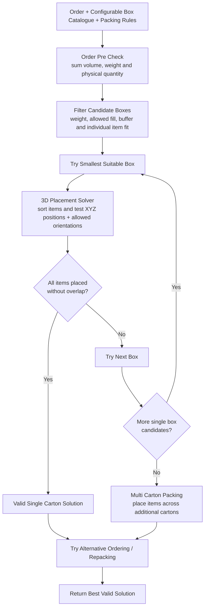

# iHub Solutions Capstone Project

NUS Industry 4.0 Master's capstone project developing a reusable 3D bin packing and cartonization solver for iHub.

## Project Goal

Build a solver that accepts **order data**, a **box catalogue** and **configurable packing rules**, then returns an explainable packing result while minimizing the number of cartons used.

The supplied 2,000 iHub request and response records are used as a benchmark for understanding the problem and evaluating our solution. The goal is not to reproduce every historical output exactly. Our solver should produce valid packing solutions that satisfy the agreed requirements and optimization objective.

The intended MVP is a reusable Python packing engine. A Python script or library interface comes first, with FastAPI optionally added later as a thin service layer over the same engine.

## Our Optimization Approach

Three dimensional bin packing is a computationally difficult optimization problem. Exact methods exist, but the literature also contains established constructive heuristics, local search, tabu search and geometric placement heuristics because solution quality must often be balanced against computational effort.

This project therefore does **not** claim that every packing returned by the solver is mathematically globally optimal.

Instead, we are building a **lightweight heuristic optimization solver** that aims to:

1. always prioritize valid, constraint compliant packing,
2. minimize the number of cartons as the primary objective,
3. return results quickly enough for practical Python or API use,
4. measure solution quality rather than assume it.

### High level solver logic

The solver first performs cheap order level checks, then performs the more important 3D placement test.

Total order volume and weight can tell us that a carton is definitely impossible, but they cannot prove that the items physically fit. A valid packing still requires the items to be placed at non overlapping XYZ positions using only permitted orientations.

The box catalogue is an input to the solver and is fully configurable. The current seven iHub cartons are benchmark defaults only.

Packing rules are also configuration driven. Under the current benchmark defaults, orders containing six or fewer physical items may use up to the full carton volume. Orders containing more than six physical items are limited to 70% volumetric fill per carton. Both the quantity threshold and fill percentage are configurable.



The most important step is the **3D placement solver**. For each item, the solver tests promising XYZ positions and permitted orientations while enforcing box boundaries, non overlap, weight, buffer and fill constraints.

For example, a `20 × 20 × 20` box has a volume of 8,000 cubic units. An item measuring `30 × 10 × 20` has a smaller volume of 6,000 cubic units, but it still cannot fit because one dimension is longer than the box in every possible orientation. Volume alone is therefore not enough.

For multiple items, the solver must determine whether they can share the same physical space without overlap. Two `15 × 10 × 10` items can fit into a `20 × 20 × 20` box by occupying different positions. Three can also fit under suitable permitted orientations and placements. This geometric placement problem is the core of the solver.

Once a valid solution exists, the solver may try a small number of alternative item orderings, carton choices or repacking attempts and keep the best valid result found within the available computational budget.

This is still an optimization project. The difference is that we optimize under a practical computational budget rather than require a proof of global optimality for every instance.

The full rationale and literature review are documented in [`docs/solver-approach-and-literature.md`](docs/solver-approach-and-literature.md). It covers exact 3D bin packing, constructive heuristics, guided local search, extreme point placement and hybrid approaches, and explains how those findings shape the project architecture.

## What Should the Solver Support?

Based on the supplied dataset, README requirements and initial EDA, the MVP solver should support:

1. **Minimize the number of boxes used** as the primary optimization objective.
2. **Accept a box catalogue** so the engine is not hard coded to one carton type or catalogue.
3. **Respect item dimensions and orientation**, including `VerticalRotation = 0` items that must remain upright.
4. **Enforce maximum box weight**, currently 20 kg for all supplied cartons.
5. **Apply the configurable bin buffer**, currently 0 mm length, 0 mm width and 6 mm height.
6. **Enforce the configurable fill rule**. Above the configured item count threshold, apply `BinMaxFillPct`, currently 70%.
7. **Handle quantity correctly** by treating `Quantity > 1` as multiple physical items for packing.
8. **Support multi box packing** and allocate items across cartons while minimizing the total number used.
9. **Return unpacked items** when no feasible solution exists.
10. **Produce explainable outputs** showing selected cartons, assigned items, orientation, placement where available, packed weight, utilization and status.
11. **Track runtime** so performance can be benchmarked using median, P95 and maximum execution time.

The detailed requirements, architecture, configuration approach, evaluation scorecard and sprint timeline are consolidated in [`docs/MVP Plan.md`](docs/MVP%20Plan.md).

## Solution Direction

The packing engine should own the complexity. Users should mainly provide three things:

1. **What needs to be packed:** order and item data
2. **What it can be packed into:** box catalogue
3. **How packing should behave:** configuration

Conceptually:

```text
Order data + Box catalogue + Configuration
                  ↓
          Reusable packing engine
                  ↓
        Explainable packing result
```

The same core engine can be called from a notebook, Python script, tests or a future FastAPI endpoint.

## Reference Dataset

The supplied sample contains 2,000 masked real iHub order request and response pairs.

| Property | Value |
| --- | --- |
| Records | 2,000 |
| Format | JSON array |
| Units | mm for dimensions, kg for weight |
| Candidate cartons | 7 fixed boxes, Box2 to Box9 |
| Optimization mode | `bins_number` |
| Result status | All 2,000 successful |
| Unpacked items | None in the supplied sample |
| Privacy | Order and item identifiers masked, no PII |

The historical outputs provide reference examples for carton selection, number of cartons, utilization and latency. Because every supplied case is feasible and successful, the team should also create its own edge cases and failure cases.

The supplied data also contains the current packing parameters:

```json
{
  "BinMaxFillCheckMinItemQty": 6,
  "BinMaxFillPct": 70,
  "BinBuffer": {
    "Length": 0,
    "Width": 0,
    "Height": 6
  }
}
```

These values are useful project defaults, but the new solver should keep them configurable.

The development dataset and its original supplied README are kept together under [`data/raw/`](data/raw/). See [`docs/dataset-specification.md`](docs/dataset-specification.md) for the consolidated field reference.

## Initial Exploratory Data Analysis

The first project analysis is available in:

[`notebooks/Inital EDA.ipynb`](notebooks/Inital%20EDA.ipynb)

The EDA establishes the initial benchmark, explores order complexity, carton usage, utilization, rotation constraints, weight, latency and multi box cases, and ends with the same MVP solver requirements summarized above.

## Evaluation Direction

The historical iHub output is a **benchmark**, while the agreed requirements define what our new solver should satisfy.

A different carton arrangement can still be a valid result if it packs the items successfully, respects the constraints and meets the optimization objective.

Evaluation should therefore consider:

1. Feasibility and successful packing.
2. Number of cartons used.
3. Carton selection.
4. Volumetric utilization.
5. Rotation, weight, buffer and fill compliance.
6. Multi box performance.
7. Correct handling of unpackable items.
8. Runtime and latency.

A key part of the project is making the term **good enough** measurable. The solver should be judged on both packing quality and computational performance. Where practical, small simplified instances may also be compared with a stronger exact method or lower bound to estimate the quality gap without making exact optimization a dependency of the operational solver.

## Repository Structure

```text
project-root/
├── data/
│   └── raw/
├── notebooks/
├── src/
├── deployment/
├── docs/
└── README.md
```

| Folder | Purpose |
| --- | --- |
| `data/` | Development datasets used by the project. |
| `notebooks/` | Exploration, solver experiments, benchmarking and analysis. |
| `src/` | Reusable packing, validation, evaluation and utility code. |
| `deployment/` | Optional API or other deployment assets. |
| `docs/` | Consolidated MVP plan, dataset specification and project documentation. |

## Current Core Project Artifacts

| Artifact | Purpose |
| --- | --- |
| [`README.md`](README.md) | High level project story and direction |
| [`notebooks/Inital EDA.ipynb`](notebooks/Inital%20EDA.ipynb) | Evidence, benchmark and exploratory analysis |
| [`docs/MVP Plan.md`](docs/MVP%20Plan.md) | Detailed features, architecture, configuration, evaluation and sprint plan |
| [`docs/solver-approach-and-literature.md`](docs/solver-approach-and-literature.md) | Literature review and rationale for the lightweight heuristic optimization approach |
| [`docs/dataset-specification.md`](docs/dataset-specification.md) | Dataset fields and supplied packing rules |

## Data Handling

This capstone repository is intended to contain development data used by the team. Development datasets may therefore be committed under `data/` so everyone can work with the same reproducible inputs.

The supplied sample comes from real iHub orders, but the development copy has masked `OrderId`, `OrderNo` and item `Code` values and contains no PII.

Do not commit production data, unmasked data, confidential or restricted data, PII, credentials, secrets or any dataset that the team is not authorised to place in this repository.

## Team Workflow

Local setup and contribution guidance are kept in [`CONTRIBUTING.md`](CONTRIBUTING.md).

AI agents working in this repository must follow [`AGENTS.md`](AGENTS.md).
