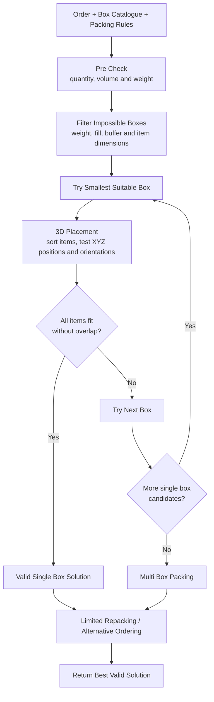

# iHub Solutions Capstone Project

NUS Industry 4.0 Master's capstone project developing a reusable 3D bin packing and cartonization solver for iHub.

## Project Goal

Build a lightweight Python solver that accepts **order data**, a **configurable box catalogue** and **configurable packing rules**, then returns a valid packing result while minimizing the number of cartons used.

The supplied 2,000 iHub request and response records are used as a benchmark. The goal is not to reproduce every historical output exactly or guarantee a mathematically global optimum for every 3D packing problem. The goal is to build a practical heuristic solver that is fast, explainable and measurable.

The Python library is the MVP. FastAPI can later be added as a thin service layer over the same packing engine.

## How the Solver Works

The solver uses cheap feasibility checks first, then performs the more important 3D placement test.

Total volume and weight can eliminate cartons that are definitely impossible, but they cannot prove that items physically fit. A valid solution still requires every item to be placed at a non overlapping XYZ position using only permitted orientations.

The **3D placement step is the core solver logic**. Passing a volume check is not enough. For example, an item measuring `30 × 10 × 20` has less volume than a `20 × 20 × 20` box, but it still cannot fit because one dimension is too long in every orientation.

For multiple items, the solver must determine whether they can occupy different XYZ positions in the same carton without overlap. Once a valid packing exists, a limited number of alternative orderings or repacking attempts can be tested and the best valid result retained.

## Configurable Packing Rules

The box catalogue is input to the solver and must not be hard coded. The supplied benchmark has already changed between dataset versions: v1 contains seven candidate cartons, while v2 contains six after Box3 was removed and Box2 was lengthened.

The packing rules are also configurable. Current benchmark defaults include:

| Rule | Default |
| --- | --- |
| Optimization objective | Minimize number of cartons |
| Fill threshold | 6 physical items |
| Maximum fill above threshold | 70% |
| Bin buffer | 0 mm length, 0 mm width, 6 mm height |
| Maximum weight | From the supplied box catalogue |
| Rotation | Item level `VerticalRotation` |

Under the current fill rule, orders with six or fewer physical items may use up to full carton volume. Orders with more than six physical items are limited to 70% volumetric fill per carton. Both values remain configurable.

## MVP Solver Capabilities

The solver should:

1. minimize carton count as the primary objective,
2. support configurable box catalogues and packing rules,
3. respect item dimensions, permitted orientations, weight, buffer and fill constraints,
4. handle `Quantity > 1` as multiple physical items,
5. support single and multi carton packing,
6. return unpacked items when no feasible solution exists,
7. return explainable results including carton selection, item placement, utilization and runtime.

## Optimization Approach

Three dimensional bin packing is computationally difficult. Exact methods exist, but the literature also contains established constructive heuristics, local search, tabu search and geometric placement heuristics.

This project therefore uses a **lightweight heuristic optimization approach**. It optimizes carton count under a practical computational budget rather than requiring proof of global optimality for every instance.

Solution quality will be measured rather than assumed. The main evaluation areas are feasibility, carton count, utilization, constraint compliance and runtime. The historical iHub outputs are a benchmark rather than mathematical ground truth.

See [`docs/solver-approach-and-literature.md`](docs/solver-approach-and-literature.md) for the literature review and design rationale.

## Reference Dataset

The supplied development benchmark contains 2,000 masked iHub order request and response pairs. Two versions are retained under [`data/raw`](data/raw/) so catalogue changes can be compared without losing the original reference run.

| Version | Records | Candidate cartons | Notes |
| --- | ---: | ---: | --- |
| v1 | 2,000 | 7 | Original catalogue |
| v2 | 2,000 | 6 | Same orders rerun after Box3 removal and Box2 resize |

Across both versions:

| Property | Value |
| --- | --- |
| Units | mm for dimensions, kg for weight |
| Optimization mode | `bins_number` |
| Result status | All 2,000 successful |
| Unpacked items | None in the supplied sample |

The historical outputs are useful for comparing carton count, carton choice, utilization and latency. The team should also create edge cases and failure cases because the supplied sample contains only successful packings.

See [`data/raw/README.md`](data/raw/README.md) for the dataset specification and [`data/raw/CHANGELOG.md`](data/raw/CHANGELOG.md) for version differences.

## Key Project Files

| Artifact | Purpose |
| --- | --- |
| [`notebooks/Inital EDA.ipynb`](notebooks/Inital%20EDA.ipynb) | Initial v1 analysis and benchmark understanding |
| [`notebooks/Inital EDA v2.ipynb`](notebooks/Inital%20EDA%20v2.ipynb) | Rerun of the initial EDA against the v2 benchmark with chart labels and written insights |
| [`docs/MVP Plan.md`](docs/MVP%20Plan.md) | Detailed features, architecture, evaluation and sprint plan |
| [`docs/solver-approach-and-literature.md`](docs/solver-approach-and-literature.md) | Literature review and solver rationale |
| [`docs/dataset-specification.md`](docs/dataset-specification.md) | Dataset fields and packing rules |
| [`data/raw/CHANGELOG.md`](data/raw/CHANGELOG.md) | Raw benchmark dataset version history |
| [`CONTRIBUTING.md`](CONTRIBUTING.md) | Team workflow |
| [`AGENTS.md`](AGENTS.md) | Instructions for AI agents working in the repository |
