# iHub Solutions Capstone Project

NUS Industry 4.0 Master's capstone project developing a reusable 3D bin packing and cartonization solver for iHub.

## Project Goal

Build a lightweight Python solver that accepts **order data**, a **configurable box catalogue** and **configurable packing rules**, then returns a valid packing result while minimizing the number of cartons used.

The supplied iHub request and response records are used as a benchmark. The goal is not to reproduce every historical output exactly or guarantee a mathematically global optimum for every 3D packing problem. The goal is to build a practical heuristic solver that is fast, explainable and measurable.

The Python library is the MVP. FastAPI can later be added as a thin service layer over the same packing engine.

The detailed functional source of truth is [`src/PRODUCT_SPEC.md`](src/PRODUCT_SPEC.md). Functional behavior should be agreed there before technical implementation changes it.

## How the Solver Works

Users should interact with one public entry point only:

```python
from ihub_packing import solve_order

result = solve_order(
    order=order,
    boxes=boxes,
    config=config,
)
```

Internally, the solver is deliberately modular so each part can be developed and unit tested independently.

```mermaid
flowchart LR
    A[solve_order API]
    B[Normalize and Validate]
    C[Feasibility Filter]
    D[Single Carton Solver]
    E[EMS Best Fit XYZ Engine]
    F[Multi Carton Solver]
    G[Bounded Improvement]
    H[Independent Validation]
    I[Result]

    A --> B --> C --> D --> E
    E -->|one carton found| G
    E -->|no one carton solution| F --> G
    G --> H --> I

    classDef focal fill:#fff4ef,stroke:#eb6c36,stroke-width:2px,color:#2d3142;
    classDef standard fill:#ffffff,stroke:#2d3142,stroke-width:1px,color:#2d3142;
    classDef input fill:#f3f5f7,stroke:#9aa1ac,stroke-width:1px,color:#2d3142;

    class A,E focal;
    class B,C,D,F,G,H standard;
    class I input;
```



### 1. Normalize and Validate

The external order is converted into stable internal models. `Quantity > 1` becomes individual physical item instances, configuration defaults are resolved, and malformed items or cartons are rejected before any packing search begins.

### 2. Feasibility Filter

Cheap checks remove cartons that are definitely impossible based on effective dimensions after buffer, weight, active fill limit and whether every individual item has at least one legal orientation that can fit.

Passing these checks does not prove that all items fit together. It only means the carton is worth trying in the 3D placement engine.

### 3. Single Carton Solver

Because minimizing carton count is the primary objective, the solver tries to pack the whole order into one carton first. Viable cartons are attempted from smallest to largest.

### 4. EMS Best Fit XYZ Engine

The selected V1 XYZ algorithm is an **Empty Maximal Space based deterministic Best Fit heuristic**.

The empty carton begins as one rectangular empty space. For each physical item the solver:

1. generates the item's legal orientations,
2. checks meaningful corner or extreme point positions inside retained empty spaces,
3. rejects out of bounds or colliding placements,
4. scores valid candidates by compactness and low placement,
5. places the best deterministic candidate,
6. updates the remaining empty spaces,
7. removes duplicate, contained or unusable spaces,
8. repeats for the next item.

This avoids scanning arbitrary XYZ coordinates and keeps the geometric search understandable and bounded.

### 5. Multi Carton Solver

If no one carton solution exists, the solver constructs a multiple carton plan. Difficult items are handled first, existing open cartons are reused where a full EMS repack still succeeds, and a new carton is opened only when required.

### 6. Bounded Improvement

Once a valid plan exists, a small deterministic set of alternative item orderings or carton elimination attempts can be tested while runtime remains.

The solver always retains the best known valid plan. Improvement is never allowed to turn a working plan into an invalid result.

### 7. Independent Validation

The final result is checked independently from the solver that created it. The validator confirms item accounting, legal orientations, carton boundaries, non overlap, weight, fill and buffer compliance before success is returned.

## Why Volume Alone Is Not Enough

Total volume and weight are useful early filters, but they cannot prove that items physically fit.

For example, an item measuring `30 x 10 x 20` has less volume than a `20 x 20 x 20` carton, but it still cannot fit because one dimension is too long in every legal orientation.

For multiple items, the solver must determine whether they can occupy different XYZ positions in the same carton without overlap. This geometric placement is the central packing problem.

## Planned Solver Modules

| Module | Functional responsibility |
| --- | --- |
| `__init__.py` | Public `solve_order()` orchestrator |
| `models.py` | Shared internal data structures |
| `normalize.py` | Input validation, defaults and quantity expansion |
| `orientation.py` | Legal item orientations |
| `feasibility.py` | Cheap carton pruning |
| `geometry.py` | Bounds and collision primitives |
| `spaces.py` | EMS creation, update, pruning and candidate positions |
| `placement.py` | Deterministic EMS Best Fit XYZ placement |
| `single_box.py` | Smallest valid one carton search |
| `multi_box.py` | Multiple carton construction |
| `improve.py` | Runtime bounded deterministic improvement |
| `validate.py` | Independent final plan validation |
| `result.py` | Stable serializable output |

The module contracts and their required unit tests are defined in [`src/PRODUCT_SPEC.md`](src/PRODUCT_SPEC.md).

## Testing Principle

Unit tests are part of the implementation of each module, not a final cleanup step.

A component is only ready for the next development phase when its functional contract and tests pass. EMS management is tested separately from placement so empty space splitting and pruning can be verified without relying on the full solver.

The normal CI suite should cover pure unit tests, component tests, end to end solver tests and regression fixtures. Historical iHub dataset benchmarking should run separately because it measures solution quality and runtime rather than basic correctness.

The final validator is intentionally independent from the placement heuristic so a bug in the solver cannot silently approve its own invalid geometry.

## Performance Direction

The solver should find a valid plan quickly and spend only the remaining runtime budget on improvements.

The initial engineering target is **P95 below 1 second per representative order**, with a target median below 250 ms. The runtime target does not weaken validity requirements.

The optimization priority is:

1. valid plan,
2. fewer cartons,
3. lower total carton volume,
4. higher utilization,
5. deterministic tie break.

## Configurable Packing Rules

The box catalogue is input to the solver and must not be hard coded. The supplied benchmark has already changed between dataset versions, so carton definitions belong in input rather than solver code.

Current benchmark defaults include:

| Rule | Default |
| --- | --- |
| Optimization objective | Minimize number of cartons |
| Fill threshold | 6 physical items |
| Maximum fill above threshold | 70% |
| Bin buffer | 0 mm length, 0 mm width, 6 mm height |
| Maximum weight | From the supplied box catalogue |
| Rotation | Item level `VerticalRotation` |

Under the current fill rule, orders with six or fewer physical items may use up to full carton volume. Orders with more than six physical items are limited to 70% volumetric fill per carton. Both values remain configurable.

## Optimization Approach

Three dimensional bin packing is computationally difficult. Exact methods exist, but this project deliberately uses a lightweight heuristic under a practical runtime budget.

V1 uses EMS based deterministic Best Fit placement for axis aligned cuboids. More complex techniques such as randomized multi start search, simulated annealing, layer backtracking, parallel workers, support ratio constraints or voxel based packing are deferred until benchmark evidence shows a real need.

This keeps the first implementation explainable and testable while leaving a clear escalation path if difficult orders expose weaknesses.

See [`docs/solver-approach-and-literature.md`](docs/solver-approach-and-literature.md) for the literature review and design rationale.

## Reference Dataset

The supplied development benchmark contains masked iHub order request and response pairs. Two versions are retained under [`data/raw`](data/raw/) so catalogue changes can be compared without losing the original reference run.

The historical outputs are useful for comparing carton count, carton choice, utilization and latency. The team should also create edge cases and failure cases because the supplied sample contains only successful packings.

See [`data/raw/README.md`](data/raw/README.md) for the dataset specification and [`data/raw/CHANGELOG.md`](data/raw/CHANGELOG.md) for version differences.

## Key Project Files

| Artifact | Purpose |
| --- | --- |
| [`src/PRODUCT_SPEC.md`](src/PRODUCT_SPEC.md) | Functional source of truth for modules, solver behavior, tests and acceptance gates |
| [`notebooks/Inital EDA.ipynb`](notebooks/Inital%20EDA.ipynb) | Initial v1 analysis and benchmark understanding |
| [`notebooks/Inital EDA v2.ipynb`](notebooks/Inital%20EDA%20v2.ipynb) | Rerun of the initial EDA against the v2 benchmark |
| [`docs/MVP Plan.md`](docs/MVP%20Plan.md) | Higher level project features, architecture, evaluation and sprint plan |
| [`docs/solver-approach-and-literature.md`](docs/solver-approach-and-literature.md) | Literature review and solver rationale |
| [`docs/dataset-specification.md`](docs/dataset-specification.md) | Dataset fields and packing rules |
| [`data/raw/CHANGELOG.md`](data/raw/CHANGELOG.md) | Raw benchmark dataset version history |
| [`CONTRIBUTING.md`](CONTRIBUTING.md) | Team workflow |
| [`AGENTS.md`](AGENTS.md) | Instructions for AI agents working in the repository |
