# iHub Solutions Capstone Project

NUS Industry 4.0 Master's capstone project developing a reusable 3D bin packing and cartonization solver for iHub.

## Project Goal

Build a lightweight Python solver that accepts **order data**, a **configurable box catalogue** and **configurable packing rules**, then returns a valid packing result while minimizing the number of cartons used.

The supplied iHub request and response records are used as a benchmark. The goal is not to reproduce every historical output exactly or guarantee a mathematically global optimum for every 3D packing problem. The goal is to build a practical heuristic solver that is fast, explainable and measurable.

The Python library is the MVP. FastAPI can later be added as a thin service layer over the same packing engine.

The reusable Python package is named **`bin_packing_3d`**. iHub remains the benchmark dataset and business use case rather than the package identity.

The detailed functional source of truth is [`src/PRODUCT_SPEC.md`](src/PRODUCT_SPEC.md). Functional behavior should be agreed there before technical implementation changes it.

## Public Solver Interface

Users should interact with one public entry point only:

```python
from bin_packing_3d import solve_order

result = solve_order(
    order=order,
    boxes=boxes,
    config=config,
)
```

The future API should remain a thin wrapper around this same function rather than introduce a second solver implementation.

## What Goes Into the Solver

The public interface has three logical inputs.

### 1. `order`: what needs to be packed

Required order information is based on the supplied iHub request format.

```json
{
  "OrderId": 1,
  "OrderNo": "1",
  "Items": [
    {
      "Code": "ITEM-001",
      "Length": 120,
      "Width": 80,
      "Height": 50,
      "Weight": 0.8,
      "UOM": "EA",
      "VerticalRotation": 1,
      "Quantity": 2
    }
  ]
}
```

| Field | Required | Meaning |
| --- | --- | --- |
| `OrderId` | Yes | Order identifier |
| `OrderNo` | Yes | External order reference |
| `Code` | Yes | Item identifier |
| `Length`, `Width`, `Height` | Yes | Item dimensions in mm |
| `Weight` | Yes | Unit weight in kg |
| `Quantity` | Yes | Number of physical units |
| `VerticalRotation` | Yes | `1` allows the item to be laid onto another axis; `0` keeps the original height vertical |
| `UOM` | No | Descriptive unit such as `EA`, `BOX`, `SET`, `PACK`, `BTL`, `PCS` |

`Quantity > 1` is expanded internally so each physical unit receives its own placement.

### 2. `boxes`: what the order may be packed into

The carton catalogue is supplied at runtime and is never hard coded into the solver.

```json
[
  {
    "Code": "Box2",
    "Length": 270,
    "Width": 170,
    "Height": 115,
    "MaxWeight": 20
  },
  {
    "Code": "Box4",
    "Length": 340,
    "Width": 260,
    "Height": 150,
    "MaxWeight": 20
  }
]
```

| Field | Required | Meaning |
| --- | --- | --- |
| `Code` | Yes | Carton identifier |
| `Length`, `Width`, `Height` | Yes | Carton dimensions in mm before the configured buffer |
| `MaxWeight` | Yes | Maximum packed weight in kg |

This matches the project requirement that the same solver continues to work when the carton catalogue changes, as already happened between the supplied v1 and v2 datasets.

### 3. `config`: how the solver should behave

```json
{
  "optimization_mode": "bins_number",
  "placement_strategy": "first_fit",
  "bin_max_fill_check_min_item_qty": 6,
  "bin_max_fill_pct": 70,
  "bin_buffer": {
    "length": 0,
    "width": 0,
    "height": 6
  },
  "max_runtime_ms": 900,
  "max_empty_spaces": 200,
  "max_candidate_positions_per_space": 8
}
```

| Configuration | Initial default | Functional meaning |
| --- | ---: | --- |
| `optimization_mode` | `bins_number` | Minimize carton count |
| `placement_strategy` | `first_fit` | `first_fit` baseline or `best_fit` comparison |
| `bin_max_fill_check_min_item_qty` | 6 | Fill cap activates above this physical item count |
| `bin_max_fill_pct` | 70 | Maximum volumetric fill once the threshold applies |
| `bin_buffer.length` | 0 mm | Reserved length clearance |
| `bin_buffer.width` | 0 mm | Reserved width clearance |
| `bin_buffer.height` | 6 mm | Reserved height clearance |
| `max_runtime_ms` | 900 ms | Search deadline for one order |
| `max_empty_spaces` | 200 | Safety cap on retained empty rectangular spaces |
| `max_candidate_positions_per_space` | 8 | Safety cap on positions evaluated inside each empty space |

The supplied iHub request shape stores these values under `Items.ItemsList`, `Bins.BinsList`, `Bins.Parameters`, and `OptimizationMode`. `normalize.py` maps that external structure into the three logical solver inputs above so existing benchmark records can be used directly.

## How the Solver Works

This chart shows the actual implementation logic from input to final result.

```mermaid
flowchart TD
    subgraph INPUT[Input]
        A1[Order\nOrderId and OrderNo\nItems with dimensions, weight, quantity and rotation]
        A2[Box catalogue\nCode, dimensions and maximum weight]
        A3[Configuration\nFirst Fit or Best Fit\nfill rule, buffer, runtime and search limits]
    end

    subgraph PREP[1. Prepare the order]
        B1[normalize.py\nValidate required fields\nExpand Quantity into physical items\nApply configuration defaults]
        B2[orientation.py\nList every allowed item orientation\nKeep upright-only items upright]
        B3[feasibility.py\nApply carton buffer\nCheck weight\nCheck fill limit\nCheck each item can fit by dimensions]
        B4[Keep only possible cartons\nTry smaller cartons first]
    end

    subgraph SINGLE[2. Try one carton first]
        C1[single_box.py\nTake the next possible carton]
        C2[spaces.py\nStart with the whole carton as one empty rectangular space]
        C3[placement.py\nOrder difficult items first]
        C4[For the current item\nTry empty spaces, allowed orientations and candidate positions]
        C5[geometry.py\nCheck carton boundaries\nCheck 3D overlap with items already placed]
        C6{Is this position valid?}
        C7{Placement strategy}
        C8[First Fit\nUse the first valid position found]
        C9[Best Fit\nCheck all valid positions\nand choose the best one]
        C10[Place the item\nSave x, y, z and chosen orientation]
        C11[spaces.py\nUpdate the remaining empty rectangular spaces\nRemove duplicates, contained spaces and spaces no remaining item can use]
        C12{Are all items placed?}
        C13{More possible cartons?}
    end

    subgraph MULTI[3. Use multiple cartons only when one carton fails]
        D1[multi_box.py\nTry to place remaining items into cartons already opened]
        D2[Re-run the same placement logic\nfor the affected carton]
        D3{Can an open carton accept the item?}
        D4[Open the smallest possible new carton]
        D5{Are all items packed?}
    end

    subgraph FINAL[4. Validate and return]
        E1[validate.py\nEvery item accounted for\nLegal orientation\nInside carton\nNo overlap\nWeight, fill and buffer respected]
        E2[result.py\nStatus\nCartons used\nUtilization\nItem x, y, z positions\nUnpacked items\nRuntime]
        E3[Return to Python caller\nor future FastAPI endpoint]
    end

    A1 --> B1
    A2 --> B1
    A3 --> B1
    B1 --> B2 --> B3 --> B4 --> C1 --> C2 --> C3 --> C4 --> C5 --> C6
    C6 -->|No, try next position| C4
    C6 -->|Yes| C7
    C7 -->|First Fit| C8 --> C10
    C7 -->|Best Fit| C9 --> C10
    C10 --> C11 --> C12
    C12 -->|No, next item| C4
    C12 -->|Yes| E1
    C12 -->|Item cannot be placed| C13
    C13 -->|Yes| C1
    C13 -->|No| D1
    D1 --> D2 --> D3
    D3 -->|Yes| D5
    D3 -->|No| D4 --> D5
    D5 -->|No, next item| D1
    D5 -->|Yes| E1
    E1 -->|Valid| E2 --> E3
    E1 -->|Invalid| E2
```



### 1. Prepare the order

`normalize.py` validates the incoming order, cartons and configuration. `Quantity > 1` is expanded into separate physical items so every unit can receive its own position.

`orientation.py` determines the legal ways each item may be turned. Items with `VerticalRotation = 0` keep their original height vertical. Items that allow vertical rotation can use any unique axis aligned orientation.

`feasibility.py` then performs quick rejection checks before any expensive 3D placement begins. It applies the carton buffer, checks maximum weight, checks the active volumetric fill rule, and confirms that every item can individually fit inside the carton in at least one allowed orientation.

Passing these checks does not prove that all items fit together. It only means the carton is worth trying.

### 2. Try one carton first

Because carton count is the primary objective, `single_box.py` tries to pack the entire order into one carton before considering multiple cartons. Possible cartons are tried from smallest to largest.

Inside a carton, `spaces.py` begins with one empty rectangular space equal to the usable inside of the carton. When an item is placed, that empty region is split into the rectangular empty regions that remain around the item. Spaces that are duplicated, fully contained inside another space, or too small for every remaining item are removed.

This is the idea behind **Empty Maximal Space packing**. In plain terms, the solver keeps track of the useful empty rectangular spaces still available after every placement instead of checking every possible coordinate inside the carton.

For each item, `placement.py` tries the remaining empty spaces, every allowed orientation, and a small number of meaningful positions such as corners and positions aligned with already packed items. `geometry.py` rejects any position that leaves the carton or overlaps an item already placed.

### 3. First Fit and Best Fit use the same geometry

The two strategies receive the same items, carton, empty spaces, orientations and valid candidate positions.

**First Fit** uses the first valid position it encounters. This should require less search and provides the latency baseline.

**Best Fit** continues checking the other valid positions and selects the preferred one using deterministic scoring. This may create tighter packing but takes more work.

The experiment therefore measures a real tradeoff rather than comparing two unrelated implementations.

### 4. Use multiple cartons only when required

If every possible single carton fails, `multi_box.py` begins a multi carton plan.

For each remaining item it first tries cartons that are already open. A proposed insertion must be proven by running the same 3D placement logic again. Volume alone is never treated as proof that the item fits.

A new carton is opened only when no existing carton can accept the item, and the smallest feasible carton is preferred.

### 5. Validate before success

`validate.py` independently checks the final result rather than trusting the placement algorithm that created it. Every item must be accounted for exactly once, use a legal orientation, remain inside its carton, avoid overlap, and satisfy weight, fill and buffer rules.

Only a validated plan can be returned as success.

## What Comes Back From the Solver

The result is JSON serializable so the same response can be used by Python, a notebook or a future FastAPI endpoint.

```json
{
  "order_id": 1,
  "order_no": "1",
  "status": "success",
  "placement_strategy": "first_fit",
  "carton_count": 1,
  "cartons": [
    {
      "code": "Box4",
      "packed_weight_kg": 1.6,
      "used_space_pct": 38.4,
      "items": [
        {
          "item_id": "ITEM-001#1",
          "code": "ITEM-001",
          "x": 0,
          "y": 0,
          "z": 0,
          "length": 120,
          "width": 80,
          "height": 50
        }
      ]
    }
  ],
  "not_packed_items": [],
  "runtime_ms": 85.2
}
```

The exact serialized field names will be finalized together with `result.py`, but the public result must include order status, cartons used, utilization, packed weight, item placement coordinates, chosen orientation, unpacked items and runtime.

## First Fit vs Best Fit Experiment

The project does not assume Best Fit is automatically better.

Both strategies use the same item ordering, legal orientations, remaining empty spaces, candidate positions, collision checks, carton rules and final validator. The only intended difference is how a valid placement is selected.

| Metric | Question |
| --- | --- |
| Valid solution rate | Do both strategies solve the same orders? |
| Average cartons per order | Does Best Fit reduce carton usage? |
| Orders with fewer cartons | How often does one strategy beat the other? |
| Total carton volume | Does one strategy choose smaller cartons when count is equal? |
| Utilization | Does packing become tighter? |
| Median runtime | What is typical latency? |
| P95 runtime | What is service level latency? |
| Maximum runtime | What happens in difficult cases? |
| Runtime delta | How much extra latency does Best Fit cost? |

The production default should be selected only after this comparison is measured.

## Why Volume Alone Is Not Enough

Total volume and weight are useful early filters, but they cannot prove that items physically fit.

For example, an item measuring `30 x 10 x 20` has less volume than a `20 x 20 x 20` carton, but it still cannot fit because one dimension is too long in every legal orientation.

For multiple items, the solver must determine whether they can occupy different XYZ positions in the same carton without overlap. This geometric placement is the central packing problem.

## Planned Solver Modules

| Module | Functional responsibility |
| --- | --- |
| `__init__.py` | Public `solve_order()` orchestrator |
| `models.py` | Shared internal data structures |
| `normalize.py` | Input validation, defaults and quantity expansion |
| `orientation.py` | Legal item orientations |
| `feasibility.py` | Quick carton rejection checks |
| `geometry.py` | Carton boundary and 3D overlap checks |
| `spaces.py` | Empty rectangular space creation, update, pruning and candidate positions |
| `placement.py` | Shared valid placement candidate engine |
| `strategies.py` | First Fit and Best Fit selection rules |
| `single_box.py` | Smallest valid one carton search |
| `multi_box.py` | Multiple carton construction |
| `improve.py` | Optional runtime bounded improvement after baseline benchmarking |
| `validate.py` | Independent final plan validation |
| `result.py` | Stable serializable output |

The module contracts and their required unit tests are defined in [`src/PRODUCT_SPEC.md`](src/PRODUCT_SPEC.md).

## Testing Principle

Unit tests are part of the implementation of each module, not a final cleanup step.

A component is only ready for the next development phase when its functional contract and tests pass. Empty space management is tested separately from placement so space splitting and pruning can be verified without relying on the full solver.

The strategy tests must also prove that First Fit and Best Fit receive the same candidate universe and apply identical geometry and business constraints.

Historical iHub dataset benchmarking should run separately because it measures solution quality and runtime rather than basic correctness.

## Performance Direction

The initial engineering target is **P95 below 1 second per representative order**, with a target median below 250 ms.

First Fit and Best Fit must be reported separately. Improvement logic should be disabled for the initial comparison so later optimization does not hide the actual placement strategy tradeoff.

The optimization priority is:

1. valid plan,
2. fewer cartons,
3. lower total carton volume,
4. higher utilization,
5. deterministic tie break.

## Configurable Packing Rules

The box catalogue is input to the solver and must not be hard coded. The supplied benchmark has already changed between dataset versions, so carton definitions belong in input rather than solver code.

Current benchmark defaults include:

| Rule | Default |
| --- | --- |
| Optimization objective | Minimize number of cartons |
| Placement strategy | `first_fit` baseline |
| Fill threshold | 6 physical items |
| Maximum fill above threshold | 70% |
| Bin buffer | 0 mm length, 0 mm width, 6 mm height |
| Maximum weight | From the supplied box catalogue |
| Rotation | Item level `VerticalRotation` |

Under the current fill rule, orders with six or fewer physical items may use up to full carton volume. Orders with more than six physical items are limited to 70% volumetric fill per carton. Both values remain configurable.

## Optimization Approach

Three dimensional bin packing is computationally difficult. Exact methods exist, but this project deliberately uses lightweight deterministic heuristics under a practical runtime budget.

V1 uses one shared empty-space geometry engine with First Fit as the baseline and Best Fit as the comparison strategy. More complex techniques such as randomized multi start search, simulated annealing, layer backtracking, parallel workers, support ratio constraints or voxel based packing are deferred until benchmark evidence shows a real need.

See [`docs/solver-approach-and-literature.md`](docs/solver-approach-and-literature.md) for the literature review and design rationale.

## Reference Dataset

The supplied development benchmark contains masked iHub order request and response pairs. Two versions are retained under [`data/raw`](data/raw/) so catalogue changes can be compared without losing the original reference run.

The historical outputs are useful for comparing carton count, carton choice, utilization and latency. The team should also create edge cases and failure cases because the supplied sample contains only successful packings.

See [`data/raw/README.md`](data/raw/README.md) for the dataset specification and [`data/raw/CHANGELOG.md`](data/raw/CHANGELOG.md) for version differences.

## Key Project Files

| Artifact | Purpose |
| --- | --- |
| [`src/PRODUCT_SPEC.md`](src/PRODUCT_SPEC.md) | Functional source of truth for modules, solver behavior, tests and acceptance gates |
| [`notebooks/Inital EDA.ipynb`](notebooks/Inital%20EDA.ipynb) | Initial v1 analysis and benchmark understanding |
| [`notebooks/Inital EDA v2.ipynb`](notebooks/Inital%20EDA%20v2.ipynb) | Rerun of the initial EDA against the v2 benchmark |
| [`docs/MVP Plan.md`](docs/MVP%20Plan.md) | Higher level project features, architecture, evaluation and sprint plan |
| [`docs/solver-approach-and-literature.md`](docs/solver-approach-and-literature.md) | Literature review and solver rationale |
| [`docs/dataset-specification.md`](docs/dataset-specification.md) | Dataset fields and packing rules |
| [`data/raw/CHANGELOG.md`](data/raw/CHANGELOG.md) | Raw benchmark dataset version history |
| [`CONTRIBUTING.md`](CONTRIBUTING.md) | Team workflow |
| [`AGENTS.md`](AGENTS.md) | Instructions for AI agents working in the repository |
