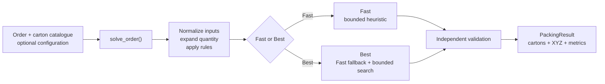
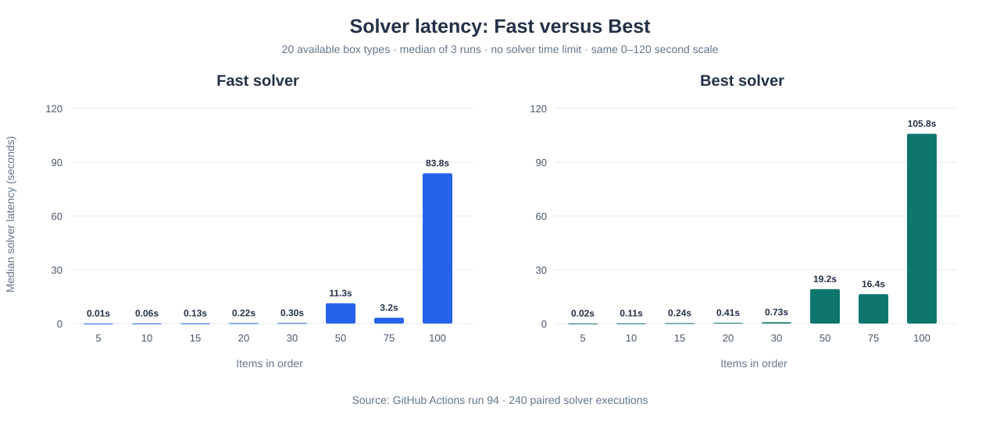
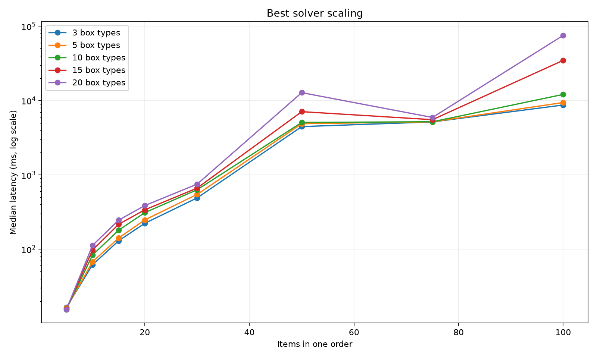

# 3D Bin Packing Solver

NUS Industry 4.0 Master's capstone project for practical 3D carton recommendation using masked iHub order data.

The package takes an order and carton catalogue, applies configurable packing rules, and returns a validated carton recommendation with item orientations and XYZ placements.

<details>
<summary><h2>Public API</h2></summary>


```python
from bin_packing_3d import solve_order

result = solve_order(
    order=order,
    boxes=boxes,
    mode="fast",
    high_item_count_threshold=6,
    high_item_count_max_fill_pct=70,
    max_fill_pct=100,
    bin_buffer={"length": 0, "width": 0, "height": 6},
    max_runtime_ms=900,
    deterministic=True,
    logs=False,
    visualize=False,
)
```

Only `order` and `boxes` are required. The remaining arguments have defaults.

The normal solver choice is:

| Mode | Use when |
| --- | --- |
| `fast` | Low latency is the priority |
| `best` | Better carton optimization justifies additional computation |

Best starts from the Fast result, then uses its remaining runtime budget to search for a better packing. If the search budget is exhausted, the validated Fast result remains the fallback.


</details>

<details>
<summary><h2>Inputs</h2></summary>


### Order

The order contains identifiers and the items to pack.

```python
order = {
    "OrderId": 1,
    "OrderNo": "ORDER-001",
    "Items": [
        {
            "Code": "SKU-001",
            "Length": 120,
            "Width": 80,
            "Height": 50,
            "Weight": 0.5,
            "Quantity": 2,
            "VerticalRotation": 1,
        }
    ],
}
```

| Field | Meaning |
| --- | --- |
| `Code` | Item identifier |
| `Length`, `Width`, `Height` | Item dimensions in millimetres |
| `Weight` | Unit weight in kilograms |
| `Quantity` | Number of physical units |
| `VerticalRotation` | Whether vertical rotation is allowed |

`Quantity` is expanded into individual physical items before packing.

### Carton catalogue

Cartons are supplied by the caller. They are not hard coded into the package.

```python
boxes = [
    {
        "Code": "Box2",
        "Length": 270,
        "Width": 170,
        "Height": 115,
        "MaxWeight": 20,
    },
    {
        "Code": "Box4",
        "Length": 340,
        "Width": 260,
        "Height": 150,
        "MaxWeight": 20,
    },
]
```

Each carton requires a code, dimensions in millimetres, and maximum weight in kilograms.

### Packing configuration

The defaults reproduce the current project packing policy.

| Argument | Default | Meaning |
| --- | ---: | --- |
| `mode` | `"fast"` | `fast` or `best` solver |
| `high_item_count_threshold` | `6` | Item count after which the stricter fill limit applies |
| `high_item_count_max_fill_pct` | `70` | Maximum usable volume fill above the threshold |
| `max_fill_pct` | `100` | Normal maximum usable volume fill |
| `bin_buffer` | height `6` mm | Clearance removed from usable carton dimensions |
| `max_runtime_ms` | `900` | Search budget |
| `deterministic` | `True` | Use deterministic solver behavior |
| `logs` | `False` | Print packing decisions |
| `visualize` | `False` | Display the validated 3D packing |

With the defaults, six or fewer physical items may use up to 100% of usable carton volume. More than six are capped at 70%. Carton weight, usable dimensions, item rotation, collision, and fill constraints are enforced by the solver and final validator.


</details>

<details>
<summary><h2>Output</h2></summary>


`solve_order()` returns a `PackingResult`.

```python
print(result)

result.packed_boxes
result.placements
result.metrics
result.validation
result.optimality_proven
result.search_status
```

The result contains:

| Output | Meaning |
| --- | --- |
| `status` | Solver result status |
| `strategy` | Internal strategy used |
| `packed_boxes` | Selected carton instances and their placements |
| `placements` | Flattened item placements across cartons |
| `runtime_ms` | Measured solver runtime |
| `metrics` | Carton count, utilization, packed volume and per carton metrics |
| `validation` | Independent validation result |
| `optimality_proven` | Whether Best proved the selected carton objective |
| `search_status` | Heuristic, optimal, or time limit status |

Each placement records the physical item, selected orientation, and XYZ position in millimetres.

For a JSON compatible representation:

```python
payload = result.to_dict()
```


</details>

<details>
<summary><h2>Optional decision logs</h2></summary>


Enable logs when you want to inspect why cartons or placements were selected or rejected.

```python
result = solve_order(
    order=order,
    boxes=boxes,
    mode="fast",
    logs=True,
)
```

```text
=== 3D packing log ===

Order summary
Physical items         | 8
Total item volume      | 5,883,400 mm^3
Total item weight      | 2.5305 kg
Effective maximum fill | 70%

Candidate cartons
Box2 | REJECTED by volume
Box4 | PASSED screen; evaluated during 3D search
Box8 | PASSED screen; evaluated during 3D search

3D search decisions
9#1  | Box4 | PLACED | best-scoring new carton and 3D placement
30#1 | Box4 | PLACED | best-scoring feasible position

Final decision
Selected carton(s): Box4
```

Logging does not change the packing result.


</details>

<details>
<summary><h2>Optional 3D visualization</h2></summary>


Set `visualize=True` to display the validated item cuboids inside the selected carton.

```python
result = solve_order(
    order=order,
    boxes=boxes,
    mode="best",
    visualize=True,
)
```


The visualization is for inspection and explanation. The XYZ coordinates establish a valid geometric packing and are not intended as exact instructions for a ground packer to reproduce.


</details>

<details>
<summary><h2>High level architecture</h2></summary>



```mermaid
flowchart LR
    I["Order + carton catalogue<br/>optional configuration"] --> API["solve_order()"]
    API --> N["Normalize inputs<br/>expand quantity<br/>apply rules"]
    N --> M{"Fast or Best"}

    M -->|Fast| F["Fast<br/>bounded heuristic"]
    M -->|Best| B["Best<br/>Fast fallback + bounded search"]

    F --> V["Independent validation"]
    B --> V
    V --> R["PackingResult<br/>cartons + XYZ + metrics"]
```

The public API owns normalization and orchestration. Fast and Best propose packing plans. The engine independently validates the selected plan before returning it.

> **Strategies propose. The engine validates.**

For implementation details, use the dedicated Fast and Best guides below rather than the README.


</details>

<details>
<summary><h2>Why Best is computationally heavy</h2></summary>


Best does more work because it starts with the Fast packing and then searches alternative carton combinations with an exact 3D feasibility model. As the order contains more items and the catalogue contains more carton types, there are more carton combinations, assignments, orientations, positions, and non-overlap relationships to evaluate.

### Escape hatch: bounded Best search

The public API lets callers bound how long Best is allowed to search using `max_runtime_ms`. Best always starts with a validated Fast packing, so the optimization search has a safe fallback. If the Best search reaches its configured time limit before finding or proving a better solution, the solver returns the validated Fast result rather than failing the order.

```python
result = solve_order(
    order=order,
    boxes=boxes,
    mode="best",
    max_runtime_ms=5_000,  # 5 second Best search budget
)
```

This makes Best a deliberate tradeoff: callers can give the optimizer more time when carton reduction matters, or keep the search tightly bounded when response time matters.

### Fast vs Best latency

The direct comparison below uses the full **20 carton type** catalogue from the same benchmark. It shows the end-to-end latency tradeoff between the two public solver modes on identical synthetic orders.



The scaling benchmark makes that cost visible. With a 5 second Best search budget, Best proved optimality through the 30-item cases in this synthetic grid. From 50 items onward, every Best run reached the search limit. At the largest tested case — **100 items × 20 carton types** — median end-to-end solver time was about **75 seconds**, showing that the surrounding candidate search can itself become expensive even when the exact-search budget is bounded.



The benchmark varies **5–100 items per order** and **3–20 available carton types**, with three deterministic repeats per combination. The full [summary](benchmark_results/solver_scaling/summary.csv), [raw results](benchmark_results/solver_scaling/raw_results.csv), and [reusable benchmark script](notebooks/benchmark_solver_scaling.py) are retained in the repository.


</details>

<details>
<summary><h2>Documentation</h2></summary>


| Document | Purpose |
| --- | --- |
| [Fast solver under the hood](docs/fast-solver-under-the-hood.md) | Fast heuristic, placement scoring and bounded carton search |
| [Best solver under the hood](docs/best-solver-under-the-hood.md) | Best search and Google OR-Tools Constraint Programming Satisfiability integration |
| [Product specification](src/PRODUCT_SPEC.md) | Detailed functional rules and API contract |
| [Solver approach and literature](docs/solver-approach-and-literature.md) | Research and solver design rationale |
| [Dataset specification](docs/dataset-specification.md) | Supplied development data and fields |
| [Solver Demo](notebooks/Solver%20Demo.ipynb) | Worked examples, Fast/Best/iHub comparisons, visualization, and the 2,000-order benchmark |
| [Solver Guardrail Simulation](notebooks/Simulated%20Rule%20Proof.ipynb) | Executable Config + Items + Boxes scenarios showing the real solver skipping cartons, choosing fallbacks, or rejecting orders when guardrails apply |

Historical iHub carton choices are used only as reference results for evaluation. They are not passed into `solve_order()` and do not determine the solver recommendation.


</details>