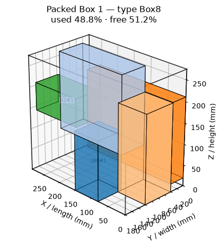
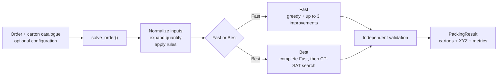
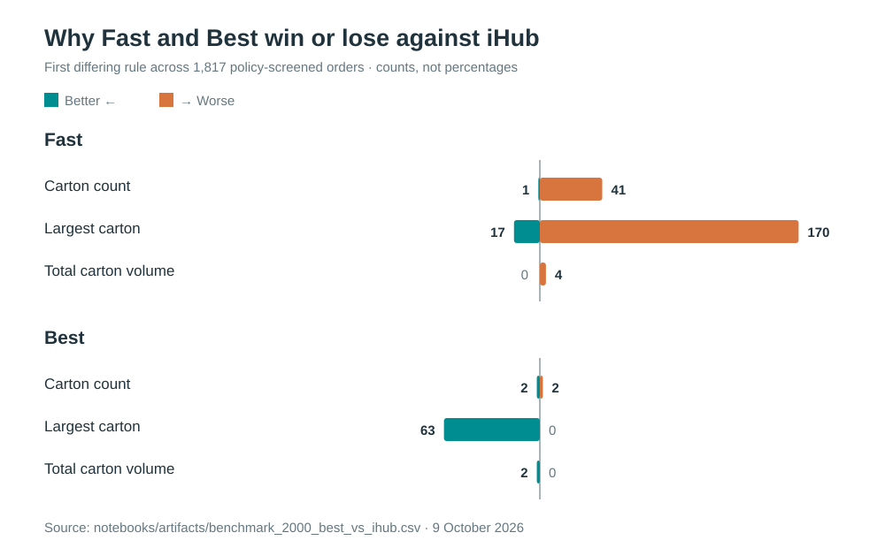

# 3D Bin Packing Solver

NUS Industry 4.0 Master's capstone project for practical 3D carton recommendation using masked iHub order data.

The package takes an order and carton catalogue, applies configurable packing rules, and returns a validated carton recommendation with item orientations and XYZ placements.

## Try the Solver Demo

**Pick an order and inspect the packing recommendation.** The [interactive Solver Demo notebook](notebooks/Solver%20Demo.ipynb) loads the original sample order and its packing constraints, runs both **Fast** and **Best**, and places their recommendations alongside iHub's recorded result.

Open the notebook, run the setup cells, then change one value:

```python
# Compare one order against iHub.
compare_order(428, visualize=True)
```

The demo shows the **number of cartons, selected carton types, fill limits, carton volume, runtime, and validation or proof status**. Set `visualize=True` to inspect the validated Best packing and its item positions.

The demo runs the solver **only for the order you select**. The completed [2,000-order benchmark CSV](notebooks/artifacts/benchmark_2000_best_vs_ihub.csv) is loaded separately for the overall scorecard, so opening the notebook does not rerun the entire benchmark. iHub's historical answer is a comparison baseline, never an input to the solver.

**[Open the Solver Demo →](notebooks/Solver%20Demo.ipynb)**

---

<details>
<summary><h2>Public API</h2></summary>


```python
from bin_packing_3d import solve_order

result = solve_order(
    order=order,
    boxes=boxes,
    mode="fast",
    high_item_count_threshold=6,
    high_item_count_max_fill_pct=70,
    max_fill_pct=100,
    bin_buffer={"length": 0, "width": 0, "height": 6},
    max_runtime_ms=5_000,
    deterministic=True,
    logs=False,
    visualize=False,
)
```

Only `order` and `boxes` are required. The remaining arguments have defaults.

The normal solver choice is:

| Mode | Priority | How it works |
| --- | --- | --- |
| `fast` | Low latency | Greedy placement followed by up to **3 attempts** to find a better valid arrangement. Return the best valid Fast result. |
| `best` | Fewer cartons | Complete Fast first and save its result as the baseline. Then use **Google OR-Tools CP-SAT** to search for a better valid three-dimensional packing. |

**Timeout and fallback:** Best defaults to **5 seconds of additional exact search after Fast finishes**. If search reaches its deadline, it returns the validated Fast baseline with `best_result_source="fast_fallback"` and `optimality_proven=False`. Best must never return more cartons than Fast for the same order and constraints.

**Benchmark scope:** The canonical saved comparison ranks **fewer cartons first**, then **lower total external carton volume** when carton counts tie. The demo scorecard and both README charts use the same saved 2,000-order run and policy filter.


</details>

<details>
<summary><h2>Inputs</h2></summary>


### Order

The order contains identifiers and the items to pack.

```python
order = {
    "OrderId": 1,
    "OrderNo": "ORDER-001",
    "Items": [
        {
            "Code": "SKU-001",
            "Length": 120,
            "Width": 80,
            "Height": 50,
            "Weight": 0.5,
            "Quantity": 2,
            "VerticalRotation": 1,
        }
    ],
}
```

| Field | Meaning |
| --- | --- |
| `Code` | Item identifier |
| `Length`, `Width`, `Height` | Item dimensions in millimetres |
| `Weight` | Unit weight in kilograms |
| `Quantity` | Number of physical units |
| `VerticalRotation` | Whether vertical rotation is allowed |

`Quantity` is expanded into individual physical items before packing.

### Carton catalogue

Cartons are supplied by the caller. They are not hard coded into the package.

```python
boxes = [
    {
        "Code": "Box2",
        "Length": 270,
        "Width": 170,
        "Height": 115,
        "MaxWeight": 20,
    },
    {
        "Code": "Box4",
        "Length": 340,
        "Width": 260,
        "Height": 150,
        "MaxWeight": 20,
    },
]
```

Each carton requires a code, dimensions in millimetres, and maximum weight in kilograms.

### Packing configuration

The defaults reproduce the current project packing policy.

| Argument | Default | Meaning |
| --- | ---: | --- |
| `mode` | `"fast"` | `fast` or `best` solver |
| `high_item_count_threshold` | `6` | Item count after which the stricter fill limit applies |
| `high_item_count_max_fill_pct` | `70` | Maximum usable volume fill above the threshold |
| `max_fill_pct` | `100` | Normal maximum usable volume fill |
| `bin_buffer` | height `6` mm | Clearance removed from usable carton dimensions |
| `max_runtime_ms` | `5000` (5 seconds) | Best search budget in milliseconds after Fast completes; `None` disables the limit |
| `deterministic` | `True` | Use deterministic solver behavior |
| `logs` | `False` | Print packing decisions |
| `visualize` | `False` | Display the validated 3D packing |

With the defaults, six or fewer physical items may use up to 100% of usable carton volume. More than six are capped at 70%. Carton weight, usable dimensions, item rotation, collision, and fill constraints are enforced by the solver and final validator.


</details>

<details>
<summary><h2>Output</h2></summary>


`solve_order()` returns a `PackingResult`.

```python
print(result)

result.packed_boxes
result.placements
result.metrics
result.validation
result.optimality_proven
result.search_status
result.best_result_source  # best_calculation, fast_fallback, or not_applicable
```

The result contains:

| Output | Meaning |
| --- | --- |
| `status` | Solver result status |
| `strategy` | Internal strategy used |
| `packed_boxes` | Selected carton instances and their placements |
| `placements` | Flattened item placements across cartons |
| `runtime_ms` | Measured solver runtime |
| `metrics` | Carton count, utilization, packed volume and per carton metrics |
| `validation` | Independent validation result |
| `optimality_proven` | Whether Best proved the selected carton objective |
| `search_status` | Heuristic, optimal, or time limit status |
| `best_result_source` | `best_calculation` for an exact-search packing; `fast_fallback` when Fast's packing is returned; `not_applicable` for Fast mode |

Each placement records the physical item, selected orientation, and XYZ position in millimetres.

For a JSON compatible representation:

```python
payload = result.to_dict()
```


</details>

<details>
<summary><h2>Optional decision logs</h2></summary>


Enable logs when you want to inspect why cartons or placements were selected or rejected.

```python
result = solve_order(
    order=order,
    boxes=boxes,
    mode="fast",
    logs=True,
)
```

```text
=== 3D packing log ===

Order summary
Physical items         | 8
Total item volume      | 5,883,400 mm^3
Total item weight      | 2.5305 kg
Effective maximum fill | 70%

Candidate cartons
Box2 | REJECTED by volume
Box4 | PASSED screen; evaluated during 3D search
Box8 | PASSED screen; evaluated during 3D search

3D search decisions
9#1  | Box4 | PLACED | remaining-order capacity estimate and valid 3D placement
30#1 | Box4 | PLACED | best-scoring feasible position

Final decision
Selected carton(s): Box4
```

Logging does not change the packing result.


</details>

<details>
<summary><h2>Optional 3D visualization</h2></summary>


Set `visualize=True` to display the validated item cuboids inside the selected carton.

```python
result = solve_order(
    order=order,
    boxes=boxes,
    mode="best",
    visualize=True,
)
```



*Example of a validated 3D packing arrangement. To explore other orders interactively, use the [Solver Demo notebook](notebooks/Solver%20Demo.ipynb).*

The visualization is for inspection and explanation. The XYZ coordinates establish a valid geometric packing and are not intended as exact instructions for a ground packer to reproduce.


</details>

<details>
<summary><h2>High level architecture</h2></summary>



```mermaid
flowchart LR
    I["Order + carton catalogue<br/>optional configuration"] --> API["solve_order()"]
    API --> N["Normalize inputs<br/>expand quantity<br/>apply rules"]
    N --> M{"Fast or Best"}

    M -->|Fast| F["Fast<br/>greedy + up to 3 improvements"]
    M -->|Best| B["Best<br/>complete Fast, then CP-SAT search"]

    F --> V["Independent validation"]
    B --> V
    V --> R["PackingResult<br/>cartons + XYZ + metrics"]
```

The public API owns normalization and orchestration. Fast and Best propose packing plans. The engine independently validates the selected plan before returning it.

> **Strategies propose. The engine validates.**

### Constraint validation: proving the solver respects our rules

A packing recommendation is only useful if it is **valid**. Fast and Best may search differently, but both must pass the **same independent final validator** before their results are accepted. This is separate from benchmarking carton count and execution time: a faster or smaller packing is not a win if it violates a rule.

| Rule | What we verify |
| --- | --- |
| Carton dimensions and clearance | Every placed item stays inside the usable carton length, width, and height after the configured buffer (default: 6 mm height) |
| Physical placement | No two items overlap in three-dimensional space |
| Allowed orientations | Every item uses an orientation permitted by its `VerticalRotation` setting |
| Maximum carton weight | Sum of placed item weights does not exceed that carton's configured `MaxWeight` |
| Volume fill policy | Up to 6 physical items: at most 100% fill; above 6: at most 70% fill by default, calculated against usable carton volume |
| Complete, unique packing | Each physical unit (including expanded `Quantity`) is placed exactly once, with no missing or duplicated units |
| Configurable rules and catalogue | Changed carton dimensions, weights, fill thresholds, and clearance values are reflected in acceptance or rejection |

**How to see the rules in action:** Run the [Solver Guardrail Simulation](notebooks/Simulated%20Rule%20Proof.ipynb). Its Config + Items + Boxes scenarios exercise the real solver and show how a rule can cause a carton to be skipped, a different carton to be selected, or an order to be rejected. Inspect `result.validation` alongside `result.packed_boxes` and `result.placements` to distinguish validation from the solver's choice.

**How to assess correctness:** For each scenario, check both a valid boundary case and an invalid case, then assert the expected outcome. The independent validator should reject invalid coordinates, collisions, prohibited rotations, overweight cartons, excessive fill, and missing or duplicate units even if a search strategy proposes them. A solver returning no feasible packing is different from returning an invalid packing.

Only **validated** recommendations should be included when comparing Fast and Best on cartons used, utilization, or latency. This section describes the verification criteria and executable demonstration; it does **not** claim that every case above has already passed automated tests.


For implementation details, use the dedicated Fast and Best guides below rather than the README.


</details>


<details>
<summary><h2>Fast vs Best: Execution Time</h2></summary>


Best does more work because it starts with the Fast packing and then searches alternative carton combinations with an exact 3D feasibility model. As the order contains more items and the catalogue contains more carton types, there are more carton combinations, assignments, orientations, positions, and non-overlap relationships to evaluate.

### Escape hatch: bounded Best search

The public API defaults to a 5-second Best search budget (`max_runtime_ms=5000`) and callers can override it. Best first completes Fast (greedy placement plus up to three improvement attempts), then starts its additional CP-SAT search budget from the validated Fast baseline. If the Best search reaches its configured time limit, return the best independently validated packing found so far; if there is no improvement, return the Fast baseline. The timeout applies to the additional Best search after Fast completes.

```python
result = solve_order(
    order=order,
    boxes=boxes,
    mode="best",
    max_runtime_ms=5_000,  # default: 5 seconds of additional Best search after Fast
)
```

This makes Best a deliberate tradeoff: callers can give the optimizer more time when carton reduction matters, or keep the search tightly bounded when response time matters.

### Solver execution time: Fast vs Best (10 October 2026)

The charts below show execution time across synthetic orders with different item counts and carton catalogue sizes.

#### Fast execution time


#### Best execution time


#### Fast baseline and additional Best runtime


**Conclusion (refreshed uncapped 240-run simulation):** At 100 items and 20 carton types, Fast's median runtime was **0.275 seconds** and Best's was **23.047 seconds**. These are synthetic, uncapped runs, not measurements of the 5-second production Best budget. The objective is fewest cartons, then lowest total external carton volume. The charts and figures are generated from the saved benchmark results.

### Fast vs Best vs iHub: carton recommendation quality


The latest saved benchmark evaluates **2,000 orders** from v2. **183 iHub Box9 fill-cap exceptions** are excluded, leaving **1,817 policy-screened comparisons**. The comparison ranks **fewer cartons first**, then **lower total external carton volume** when counts tie.

- **Fast: 18 better / 1,584 same / 215 worse**
- **Best: 67 better / 1,750 same / 0 worse**

#### What drives improvements and losses



| First differing objective | Fast better | Fast worse | Best better | Best worse |
| --- | ---: | ---: | ---: | ---: |
| Number of cartons | 1 | 41 | 2 | 0 |
| Smaller box (single-box orders) | 17 | 170 | 62 | 0 |
| Lower total box volume (multi-box orders) | 0 | 4 | 3 | 0 |

Each non-equal order is counted once, against the first differing objective. A matching result means the **ranked carton objective** ties, not necessarily that carton types or item placements match. iHub's recorded recommendations are historical references, not independently verified three-dimensional packings.

[Download the 2,000-order benchmark CSV](notebooks/artifacts/benchmark_2000_best_vs_ihub.csv) · [Open the executed Solver Demo](notebooks/Solver%20Demo.ipynb)

</details>

<details>
<summary><h2>Documentation</h2></summary>


| Document | Purpose |
| --- | --- |
| [Fast solver under the hood](docs/fast-solver-under-the-hood.md) | Fast heuristic, placement scoring and bounded carton search |
| [Best solver under the hood](docs/best-solver-under-the-hood.md) | Best search and Google OR-Tools Constraint Programming Satisfiability integration |
| [Product specification](src/PRODUCT_SPEC.md) | Detailed functional rules and API contract |
| [Research and literature](docs/solver-approach-and-literature.md) | Academic references and rationale for the chosen approach |
| [Development datasets](data/raw/README.md) | v1/v2 schemas, carton catalogues and packing parameters ([change log](data/raw/CHANGELOG.md)) |
| [Solver Demo](notebooks/Solver%20Demo.ipynb) | Select any order, compare live Fast/Best against iHub, inspect 3D placements, and view the saved benchmark |
| [Solver Guardrail Simulation](notebooks/Simulated%20Rule%20Proof.ipynb) | Executable Config + Items + Boxes scenarios showing the real solver skipping cartons, choosing fallbacks, or rejecting orders when guardrails apply |

Historical iHub carton choices are used only as reference results for evaluation. They are not passed into `solve_order()` and do not determine the solver recommendation.


</details>