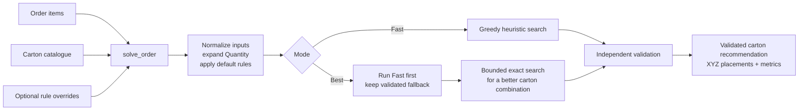
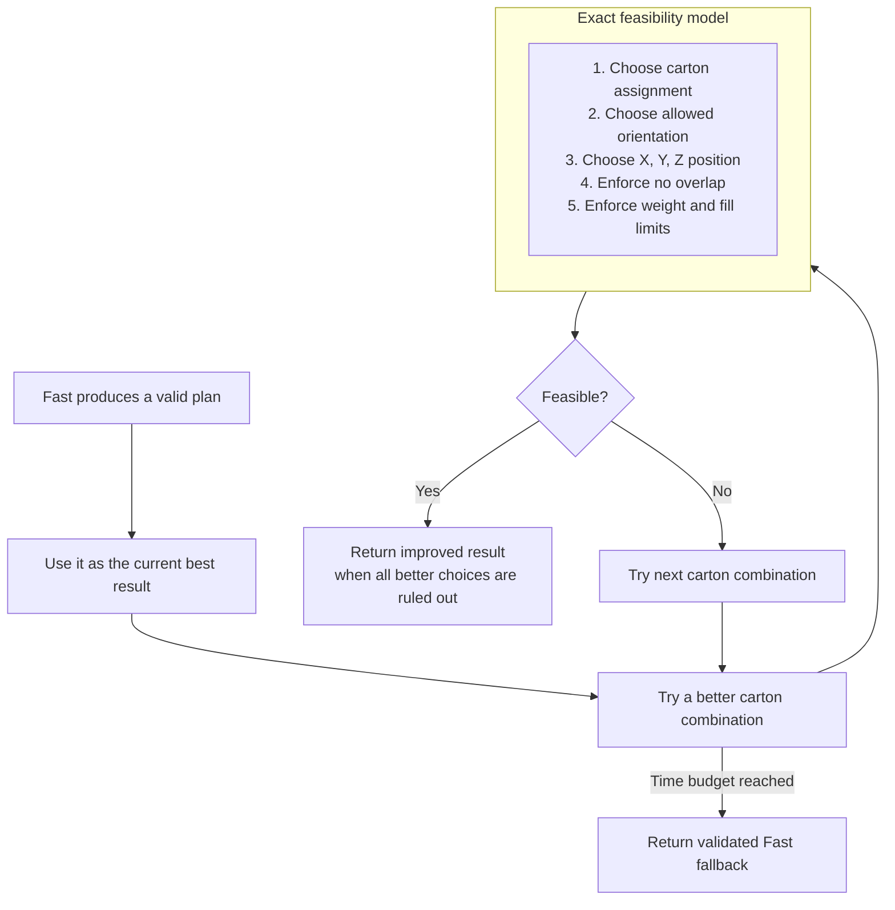

# 3D Bin Packing Solver

NUS Industry 4.0 Master's capstone project for practical 3D carton recommendation using masked iHub order data.

The solver takes an order, a configurable carton catalogue, and optional packing rules, then returns a validated carton recommendation with item orientations and XYZ placements.

The public API exposes two modes:

- **Fast** uses a deterministic greedy heuristic to produce a strong result quickly.
- **Best** starts from Fast's validated result, then uses a bounded exact search to look for a better carton combination.

Both modes use the same packing rules and the same independent final validator.

## Quick start

```python
from bin_packing_3d import solve_order

result = solve_order(
    order=order,
    boxes=boxes,
    mode="fast",
)

print(result)
```

`solve_order()` is the main public interface. The carton catalogue is supplied by the caller and is not hard-coded into the package.

The default packing rules are already built into the solver:

```python
result = solve_order(
    order=order,
    boxes=boxes,
    mode="fast",
    high_item_count_threshold=6,
    high_item_count_max_fill_pct=70,
    max_fill_pct=100,
    bin_buffer={"length": 0, "width": 0, "height": 6},
    max_runtime_ms=900,
)
```

These values are optional overrides. A normal caller does not need to pass them unless the business rules change.

By default:

- orders with up to 6 physical items may use up to 100% of usable carton volume
- orders with more than 6 physical items are capped at 70%
- 6 mm is removed from usable carton height
- carton weight limits are enforced
- item rotation follows the supplied `VerticalRotation` rule
- dimensions and XYZ coordinates use millimetres
- weights use kilograms

## How the solver actually works

The package separates orchestration, packing strategy, and validation.


```mermaid
flowchart LR
    A[Order items] --> C[solve_order]
    B[Carton catalogue] --> C
    R[Optional rule overrides] --> C

    C --> N[Normalize inputs<br/>expand Quantity<br/>apply default rules]
    N --> S{Mode}

    S -->|Fast| F[Greedy heuristic search]
    S -->|Best| G[Run Fast first<br/>keep validated fallback]

    G --> E[Bounded exact search<br/>for a better carton combination]

    F --> V[Independent validation]
    E --> V

    V --> O[Validated carton recommendation<br/>XYZ placements + metrics]
```

The engine does not trust a strategy simply because it returned a packing. Every proposed plan is checked independently for item accounting, allowed orientation, carton boundaries, collisions, weight, fill limits, and carton identity before it can be returned.

## Fast vs Best

The two modes solve the same problem differently.

### Fast: greedy heuristic

Fast places larger items first and repeatedly chooses the best feasible placement available at that moment.

For each item it:

1. checks feasible orientations and XYZ positions in cartons already open
2. scores those placements
3. chooses the best current placement
4. opens the smallest suitable carton if another carton is required
5. also tries promising fixed-carton combinations to escape simple smallest-carton-first mistakes

This is fast because it does not exhaustively reconsider every earlier placement.

Its limitation is the normal greedy tradeoff: a placement that looks best now can make later items harder to pack.

### Best: bounded exact search

Best first runs Fast and keeps that valid result as a fallback.

It then asks a different question:

> Does there exist any valid arrangement of all items inside a better carton combination?

For each candidate carton combination, Best uses OR-Tools CP-SAT to solve the packing decisions together.


```mermaid
flowchart TD
    A[Fast produces a valid plan] --> B[Use it as the current best result]
    B --> C[Try a better carton combination]

    C --> D

    subgraph D["Exact feasibility model"]
        direction TB
        D1["1. Choose carton assignment<br/>2. Choose allowed orientation<br/>3. Choose X, Y, Z position<br/>4. Enforce no overlap<br/>5. Enforce weight and fill limits"]
    end

    D --> E{Feasible?}
    E -->|Yes| F[Return improved result<br/>when all better choices are ruled out]
    E -->|No| G[Try next carton combination]
    G --> C

    C -->|Time budget reached| H[Return validated Fast fallback]
```

For a fixed carton combination, the exact model decides:

- which carton each item belongs to
- which allowed orientation each item uses
- the X, Y, and Z position of each item
- whether every pair of items is separated in at least one direction
- whether every item remains inside its carton
- whether carton weight and fill limits are satisfied

If the model proves that a carton combination is impossible, Best can move to the next candidate with confidence. If it finds a feasible arrangement after all better combinations have been ruled out, the result can be marked as proven optimal under the solver objective.

## What does "best" mean?

The solver compares valid packing plans in this order:

1. **Use the smallest number of cartons**
2. **Use the smallest possible carton**
3. **Use the smallest total carton volume**

This objective is applied consistently when Best searches carton combinations.

## Why Best requires more computation

Fast makes a sequence of local placement decisions.

Best must consider many decisions together. For every item it may need to determine carton assignment, orientation, X, Y, and Z coordinates. It must also enforce non-overlap between pairs of items.

The number of item pairs alone grows quickly:

| Physical items | Item pairs |
| ---: | ---: |
| 10 | 45 |
| 20 | 190 |
| 50 | 1,225 |

Search difficulty also depends on:

- how many rotations are allowed
- how many carton combinations are candidates
- how tightly the items fit
- how many arrangements are almost feasible
- how much work is required to prove that a better carton combination is impossible

A larger order is therefore generally more expensive for Best, although item count alone does not determine difficulty.

This is why Best is intentionally time bounded.

A timeout does **not** mean packing failed. It means Best could not finish proving an improvement within the configured search budget, so the already validated Fast result is returned.

## Cheap checks before exact search

Best does not send every carton combination directly into CP-SAT.

Before exact search it rejects combinations that obviously cannot work, including cases where:

- total usable volume under the active fill cap is too small
- total carton weight capacity is too small
- an individual item cannot fit into any carton in the combination

These checks reduce unnecessary exact-search work.

## Independent validation

Both strategies must pass the same final validation.

A returned result must satisfy:

- every physical item is accounted for
- every orientation is allowed
- every item remains within usable carton boundaries
- no packed items overlap
- carton weight limits are respected
- the active fill percentage is respected
- carton codes and assignments are valid

This gives the package a simple development principle:

> **Strategies propose. The engine validates.**

The XYZ coordinates prove that a proposed arrangement is geometrically valid. They are not intended as exact instructions that a ground packer must reproduce.

## Optional logging and 3D visualization

Use `logs=True` to inspect screening and search decisions:

```python
result = solve_order(
    order=order,
    boxes=boxes,
    mode="fast",
    logs=True,
)
```

Use `visualize=True` to render the validated packing:

```python
result = solve_order(
    order=order,
    boxes=boxes,
    mode="fast",
    visualize=True,
)
```

Logging and visualization do not change the packing result.

## Current development benchmark

The current benchmark reruns Fast and Best across the 2,000 masked v2 development orders.

| Comparison | Result |
| --- | --- |
| Best vs Fast | **404 improved, 1,596 tied, 0 worse** |
| Best proof status | **1,900 proven, 100 time-limited** |
| Observable iHub fill policy | **1,817 pass, 183 fail** |
| Best vs policy-compliant iHub | **67 better, 1,750 equal, 0 worse** |

The Fast fallback means Best cannot intentionally return a worse solver objective than Fast. The benchmark therefore shows how often the bounded exact search successfully improves that fallback.

### Warm latency on the saved development run

| System | Median | P95 |
| --- | ---: | ---: |
| Fast | 4.703 ms | 69.123 ms |
| Best | 54.972 ms | 794.393 ms |
| Recorded iHub reference | 187.250 ms | 441.990 ms |

Fast has the lowest latency and most predictable tail.

Best has a lower median than the recorded iHub reference in this development run, but its P95 is higher because harder orders can consume most of the exact-search budget.

These latency values are machine and environment specific and should not be treated as universal performance guarantees.

## Current conclusion

The implementation supports two useful operating choices.

**Use Fast when latency is the main priority.** It produces a validated packing quickly and is the safest choice for larger or latency-sensitive workloads.

**Use Best when packing quality justifies additional computation.** It keeps Fast as a safe fallback and uses the remaining time budget to search for fewer or smaller cartons.

The development results show that exact search can repair meaningful greedy gaps, but they also show why an unlimited exact search would not be suitable for every order.

The 2,000 orders were used during development, so these results are not an independent holdout. A final evaluation should freeze the solver and configuration, run against a new masked dataset, and reveal the reference iHub results only after solver outputs are saved.

## Project structure

| Module | Responsibility |
| --- | --- |
| `engine.py` | Public orchestration through `solve_order()`, runtime measurement, metrics, logging, visualization hook, and final validation |
| `models.py` | Items, cartons, orientations, positions, packing plans, metrics, results, and errors |
| `rules.py` | Input normalization, quantity expansion, rotation rules, usable carton dimensions, and effective fill rules |
| `placement.py` | Feasible XYZ placement generation and collision/boundary checks used by Fast |
| `validate.py` | Independent validation of every proposed packing plan |
| `solvers.py` | Common strategy registration and lookup |
| `strategies/best_fit.py` | Production **Fast** greedy heuristic and bounded fixed-carton search |
| `strategies/exact_fit.py` | Production **Best** bounded CP-SAT exact search with Fast fallback |
| `display.py` | Notebook-friendly result tables |
| `visualize.py` | Optional 3D visualization |

```text
src/bin_packing_3d/
├── __init__.py
├── engine.py
├── models.py
├── rules.py
├── placement.py
├── validate.py
├── solvers.py
├── display.py
├── visualize.py
└── strategies/
    ├── best_fit.py
    └── exact_fit.py
```

## Further documentation

| Document | Purpose |
| --- | --- |
| [Product specification](src/PRODUCT_SPEC.md) | Detailed functional rules and API contract |
| [Solver approach and literature](docs/solver-approach-and-literature.md) | Background research and design rationale |
| [Dataset specification](docs/dataset-specification.md) | Supplied development data and fields |
| [Solver Demo](notebooks/Solver%20Demo.ipynb) | Worked examples, Fast/Best/iHub comparisons, visualization, and the 2,000-order benchmark |

Historical iHub carton choices are used as reference results for evaluation. They are not passed into `solve_order()` and do not determine the solver recommendation.
