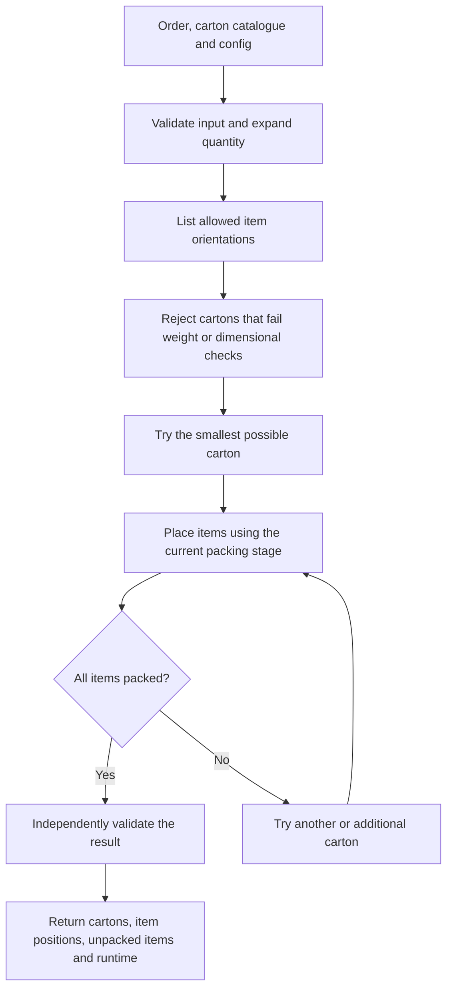

# Architecture

The product is a reusable Python 3D bin-packing library. Users clone or install the package, import `bin_packing_3d`, and call the public solver function directly.

## Package boundary

```text
src/bin_packing_3d/
  __init__.py
  models.py
  normalize.py
  orientation.py
  feasibility.py
  geometry.py
  spaces.py
  placement.py
  strategies.py
  single_box.py
  multi_box.py
  improve.py
  validate.py
  result.py
```

Normal users should call only:

```python
from bin_packing_3d import solve_order
```

## End-to-end flow



The current implementation milestone is intentionally simpler than the full architecture: MVP 0 uses one physical item per carton and therefore does not yet need item-to-item overlap checks or remaining-empty-space tracking.

## Module responsibilities

| Module | Responsibility |
| --- | --- |
| `__init__.py` | Public `solve_order()` entry point |
| `models.py` | Shared input, internal and result models |
| `normalize.py` | Validation, defaults and quantity expansion |
| `orientation.py` | Allowed 90-degree item orientations |
| `feasibility.py` | Weight and dimension checks; carton ordering |
| `geometry.py` | Carton-boundary and item-overlap checks in later milestones |
| `spaces.py` | Remaining empty-space management in later milestones |
| `placement.py` | Shared multi-item placement candidate engine |
| `strategies.py` | First Fit and Best Fit selection rules |
| `single_box.py` | One-carton search |
| `multi_box.py` | Multiple-carton construction |
| `improve.py` | Optional bounded improvement after baseline benchmarking |
| `validate.py` | Independent final validation |
| `result.py` | Stable serializable output |

## Design rules

The package is client-neutral. iHub-shaped benchmark data is normalized at the boundary; core packing logic stays reusable.

The public Python interface should remain small and stable while the internal packing algorithm becomes more capable.

Each later algorithm stage should reuse the same input and output contract so packing quality can improve without breaking package users.

A web or service wrapper may be added later if there is a real deployment need, but it is not part of the current MVP.

For the detailed component contracts, see [`../src/PRODUCT_SPEC.md`](../src/PRODUCT_SPEC.md).
