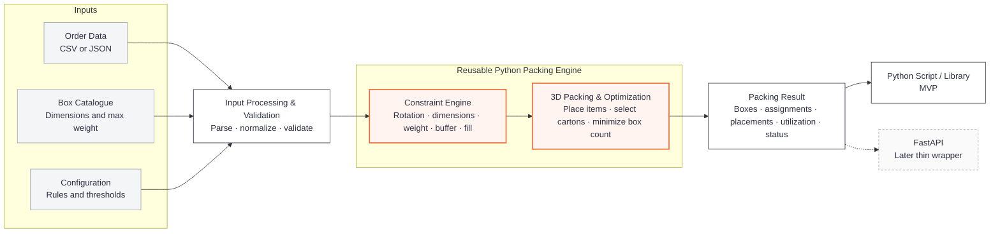

# MVP Plan

## Project Goal

Build a reusable 3D bin packing and cartonization solver for iHub that accepts order data, a box catalogue and configurable packing rules, then returns an explainable packing result while minimizing the number of cartons used.

The supplied 2,000 iHub request and response records are used as a benchmark for understanding the problem and evaluating our solver. The goal is not to reproduce every historical output exactly. The new solver should produce valid packing solutions that satisfy the agreed requirements and optimization objective.

The core solution should be implemented as reusable Python modules and functions. A Python script or library interface is the MVP. FastAPI can later provide a thin service layer over the same engine.

## Key Question

### What features should our solver have?

Based on the supplied dataset, README requirements and initial EDA, the MVP solver should support the following.

1. **Minimize the number of boxes used** as the primary optimization objective.
2. **Accept a box catalogue** rather than hard coding the engine to one carton type.
3. **Respect item dimensions and orientation**, including `VerticalRotation = 0` items that must remain upright.
4. **Enforce maximum box weight**, currently 20 kg for all supplied cartons.
5. **Apply the configurable bin buffer**, currently 0 mm length, 0 mm width and 6 mm height.
6. **Enforce the configurable fill rule**. Above the configured item count threshold, apply `BinMaxFillPct`, currently 70%.
7. **Handle quantity correctly** by treating `Quantity > 1` as multiple physical items for packing.
8. **Support multi box packing** and allocate items across cartons while minimizing the total number used.
9. **Return unpacked items** when no feasible solution exists.
10. **Produce explainable outputs** showing selected cartons, assigned items, orientation, placement where available, packed weight, utilization and status.
11. **Track runtime** so performance can be benchmarked using median, P95 and maximum execution time.

## Supplied Box Catalogue

The current project benchmark uses seven carton types. The catalogue is fixed in the supplied dataset, but the solver should accept it as input so another catalogue can be used later without changing the packing engine.

| Box | Length (mm) | Width (mm) | Height (mm) | Max Weight (kg) |
|---|---:|---:|---:|---:|
| Box2 | 220 | 170 | 115 | 20 |
| Box3 | 270 | 180 | 180 | 20 |
| Box4 | 340 | 260 | 150 | 20 |
| Box5 | 340 | 260 | 235 | 20 |
| Box6 | 340 | 260 | 280 | 20 |
| Box8 | 290 | 180 | 280 | 20 |
| Box9 | 440 | 345 | 280 | 20 |

## Config Driven Design

The packing engine should own the complexity. Users should mainly provide three things:

1. **What needs to be packed:** order and item data
2. **What it can be packed into:** box catalogue
3. **How packing should behave:** configuration

The objective is to allow common packing behaviour to change through configuration rather than requiring users to edit the solver code.

Current benchmark configuration:

```json
{
  "optimization_mode": "bins_number",
  "bin_max_fill_check_min_item_qty": 6,
  "bin_max_fill_pct": 70,
  "bin_buffer": {
    "length": 0,
    "width": 0,
    "height": 6
  }
}
```

The supplied values should act as project defaults while remaining configurable.

## Solution Architecture

The architecture follows one principle: **one reusable packing engine, multiple ways to use it**.



### Core Python Interface

The packing logic should remain normal reusable Python code.

```python
result = solve_order(
    order=order,
    boxes=boxes,
    config=config,
)
```

The same function can be called from notebooks, scripts, tests or a future API.

### FastAPI Later

FastAPI should be a thin wrapper rather than a second implementation of the solver.

Conceptually:

```python
@app.post("/pack")
def pack(request):
    return solve_order(request.order, request.boxes, request.config)
```

## Input Direction

### Order Data

The MVP should support the supplied iHub JSON format directly.

Minimum item information required for packing:

| Field | Purpose |
|---|---|
| `Code` | Item identifier |
| `Length`, `Width`, `Height` | Item dimensions in mm |
| `Weight` | Unit weight in kg |
| `Quantity` | Number of physical units |
| `VerticalRotation` | Whether the item may be laid down / rotated |
| `UOM` | Descriptive metadata |

CSV can be provided as a convenience input and normalized into the same internal order structure used by JSON.

### Box Catalogue

Minimum box information:

| Field | Purpose |
|---|---|
| `Code` | Box identifier |
| `Length`, `Width`, `Height` | Carton dimensions in mm |
| `MaxWeight` | Maximum packed weight |

### Configuration

For the MVP, configurable behaviour should include:

| Configuration | Current Default |
|---|---|
| Optimization mode | `bins_number` |
| Fill threshold | 6 physical items |
| Maximum fill | 70% |
| Bin buffer | 0, 0, 6 mm |
| Candidate boxes | Supplied catalogue |
| Item rotation | Item level `VerticalRotation` |

## Output Direction

The result should be easy to inspect and validate.

A simplified result may look like:

```json
{
  "order_id": "ORDER-001",
  "status": "success",
  "bins_used": 1,
  "bins": [
    {
      "code": "Box3",
      "used_space_pct": 48.2,
      "packed_weight_kg": 1.15,
      "items": []
    }
  ],
  "not_packed_items": [],
  "runtime_ms": 205
}
```

As the geometric solver matures, item position and orientation should also be returned so the packing arrangement can be validated and potentially visualized.

## Evaluation Approach

The historical iHub output is a **benchmark**, while the agreed requirements define what our new solver should satisfy.

A different carton arrangement is acceptable if it is feasible, respects the constraints and meets the optimization objective.

Suggested evaluation scorecard:

| Area | Metric |
|---|---|
| Feasibility | Percentage of orders where all items are validly packed |
| Primary objective | Number of boxes used |
| Reference comparison | Exact reference bin count match rate |
| Carton selection | Selected box match rate |
| Space efficiency | Volumetric utilization |
| Weight compliance | No carton exceeds maximum weight |
| Rotation compliance | Upright only items remain upright |
| Fill compliance | Configured maximum fill is respected |
| Buffer compliance | Required clearance is respected |
| Difficult cases | Performance on multi box orders |
| Failure handling | Correct reporting of unpackable items |
| Performance | Median, P95 and maximum runtime |

## Tentative Sprint Timeline

| Sprint | Focus | MVP Deliverable |
|---|---|---|
| Sprint 0 | Data and requirements understanding | Initial EDA, requirements and benchmark established |
| Sprint 1 | Core data structures and validation | Orders, items, boxes, quantities, rotations and config represented cleanly in Python |
| Sprint 2 | Single box packing | Valid 3D placement inside one candidate carton |
| Sprint 3 | Multi box optimization | Multiple cartons supported and total box count minimized |
| Sprint 4 | Business constraints and benchmarking | Rotation, weight, buffer, fill rules and benchmark comparison complete |
| Sprint 5 | MVP packaging | Reusable Python interface, tests, documentation and optional FastAPI demonstration |

### Sprint 0: Data and Requirements

Use the supplied data and initial EDA to understand the problem, establish baseline metrics and agree on solver requirements.

### Sprint 1: Solver Foundation

Build reusable models and validation for items, boxes, orders, quantities, configuration and packing constraints.

### Sprint 2: Single Box 3D Packing

Implement item orientation, coordinates, box boundary checks, collision detection and an initial packing heuristic.

### Sprint 3: Multi Box Packing and Carton Selection

Try candidate cartons, determine when one carton is insufficient, allocate items across multiple cartons and minimize the total number of cartons.

### Sprint 4: Business Rules and Benchmarking

Complete the 20 kg maximum weight rule, upright only handling, configurable buffer, configurable 70% fill rule and benchmark the solver against the reference sample.

### Sprint 5: MVP Packaging

Expose a clean reusable Python interface, complete tests and documentation, and optionally demonstrate the same engine through FastAPI.

## MVP Boundary

### In Scope

1. Reusable Python packing engine
2. iHub compatible JSON input
3. Optional CSV input loader
4. Configurable box catalogue
5. Configurable packing rules
6. Single and multi box packing
7. 3D placement and collision validation
8. Minimize number of cartons
9. Explainable packing output
10. Unpackable item handling
11. Benchmarking and runtime measurement
12. Python script or library interface
13. Optional FastAPI demonstration

### Later or Out of Scope for the Initial MVP

1. Production authentication
2. Persistent database integration
3. Web user interface
4. Cloud infrastructure and enterprise deployment
5. Additional optimization modes
6. Advanced configurable heuristics
7. Production scale monitoring and orchestration

## Working Principle

**Order data + Box catalogue + Configuration → Reusable packing engine → Explainable packing result**

The interface can evolve. The packing engine remains reusable.