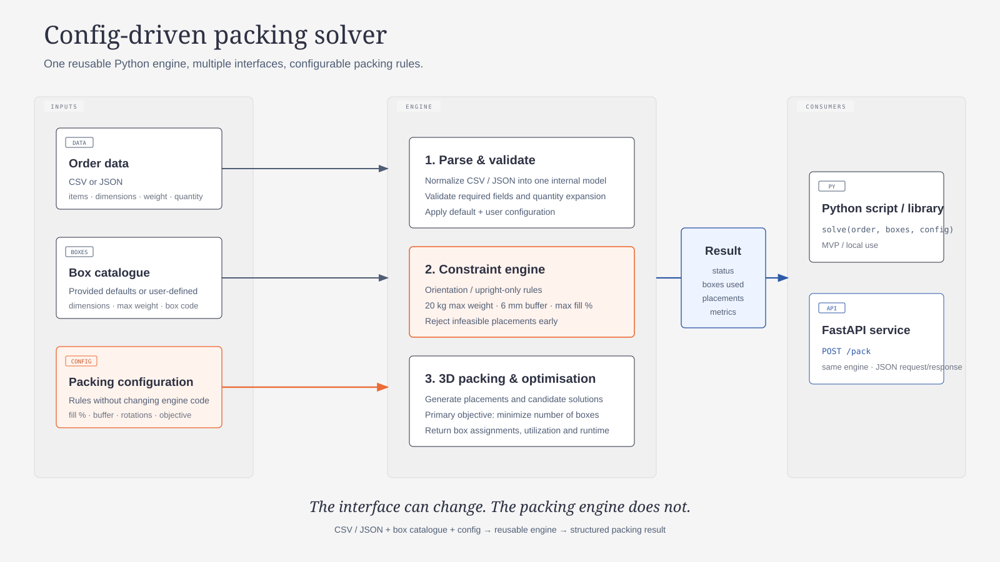

# Solution Architecture

The proposed MVP uses a **config-driven reusable Python packing engine**. Users provide three things:

1. **Order data** in CSV or JSON
2. **Box catalogue** containing the available carton types
3. **Packing configuration** containing the rules or preferences that can vary between use cases

The underlying engine then handles validation, packing constraints, 3D placement and optimization. The same engine can be called directly from Python or exposed through a FastAPI endpoint later.



## Design principle

> The interface can change. The packing engine does not.

This keeps the core packing logic reusable and testable while allowing different users or systems to interact with it in different ways.

## Simplified flow

`Order data + Box catalogue + Config → Validation → Constraint Engine → 3D Packing & Optimization → Packing Result`

The result can then be consumed through either:

- a Python script / library for the MVP
- a FastAPI service such as `POST /pack`

## Config-driven approach

Users should be able to change supported behavior through configuration rather than modifying solver code. Candidate configurable parameters include:

| Parameter | Purpose |
|---|---|
| `BinMaxFillPct` | Maximum allowed volumetric fill |
| `BinMaxFillCheckMinItemQty` | Item-count threshold before the fill cap applies |
| `BinBuffer` | Required clearance inside the carton |
| `MaxWeight` | Maximum allowed carton weight |
| `VerticalRotation` | Whether an item can be rotated from its vertical orientation |
| `OptimizationMode` | Primary optimization objective, initially `bins_number` |
| `CandidateBins` | Which cartons are available to the solver |

The supplied iHub values can become the defaults, while the architecture remains flexible enough for different box catalogues and packing rules later.

## MVP boundary

The first MVP should focus on the reusable Python engine and a simple callable interface such as:

```python
result = solve(order, boxes, config)
```

FastAPI should remain a thin interface over the same engine rather than containing packing logic itself.
