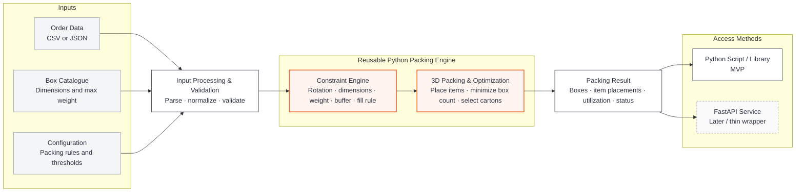

# Solution Architecture

This diagram shows the intended MVP architecture for the reusable 3D bin-packing solution.

The key design principle is that the **packing engine remains independent of how users access it**. Users can call the same engine from a Python script or, later, through a FastAPI endpoint.



## How to read the flow

### 1. Inputs

The user provides three things:

| Input | Purpose |
|---|---|
| **Order data** | Items to pack, including dimensions, weight, quantity and rotation rules |
| **Box catalogue** | The cartons available to the solver, including dimensions and maximum weight |
| **Configuration** | Optional rules that control solver behaviour without changing the code |

For the supplied iHub sample, the box catalogue contains the seven fixed carton types from `Box2` to `Box9`. The architecture should nevertheless allow the catalogue to be supplied as data so the engine remains reusable.

## 2. Input processing and validation

Before packing begins, the input layer converts the incoming data into a common internal structure.

This layer should:

- accept JSON and CSV input
- validate required fields and values
- expand quantities into physical packing items where required
- normalize field names and data types
- apply default configuration values where the user has not supplied overrides

The packing engine therefore receives the same internal structures regardless of whether the original request came from CSV, JSON, a Python function or an API request.

## 3. Reusable Python packing engine

The core engine contains the actual business and optimization logic.

### Constraint engine

Checks the rules that define whether a placement is valid, including:

- box boundaries and item dimensions
- allowed item orientations
- `VerticalRotation` / upright-only items
- maximum carton weight
- configurable bin buffer
- configurable maximum fill rule

### 3D packing and optimization

Attempts valid placements and selects the best packing solution.

The primary MVP objective is:

> **Minimize the number of boxes required to pack the order while satisfying all configured constraints.**

Secondary criteria such as smaller total carton volume or higher utilization can be added later as tie-breakers without changing the external interface.

## 4. Packing result

The engine returns a structured result that can include:

- success or failure status
- number of boxes used
- selected box types
- items assigned to each box
- item position and orientation
- packed weight
- volumetric utilization
- unpacked items, if any
- runtime and diagnostic information

JSON should be the standard output representation even when the solver is called directly from Python.

## 5. Multiple interfaces, one engine

The interfaces should remain thin wrappers around the same core function.

### Python script / library — MVP

A simple call could eventually look like:

```python
result = solve_order(order, boxes, config)
```

The solver can therefore be used from notebooks, Python scripts, tests or other Python applications.

### FastAPI — later interface

FastAPI can expose the same engine through an HTTP endpoint, for example:

```text
POST /pack
```

The API layer should only handle request/response concerns such as schema validation and HTTP responses. It should **not duplicate the packing logic**.

Conceptually:

```python
@app.post("/pack")
def pack(request):
    return solve_order(request.order, request.boxes, request.config)
```

## Config-driven design

The engine should provide sensible defaults but allow selected behaviour to be overridden through configuration.

Example:

```json
{
  "bin_max_fill_check_min_item_qty": 6,
  "bin_max_fill_pct": 70,
  "bin_buffer": {
    "length": 0,
    "width": 0,
    "height": 6
  },
  "optimization_mode": "bins_number"
}
```

The key principle is:

> **Change configuration for different use cases instead of changing the packing engine code.**

This follows the same reusable-core approach used in modular Python frameworks: stable underlying functions, configurable behaviour, and multiple ways to consume the same engine.

## MVP boundary

For the capstone MVP, the priority is the reusable Python engine and a simple script/library interface.

FastAPI is useful as a demonstration that the engine can become a service, but deployment, authentication, persistence, user interfaces and production-scale infrastructure are outside the initial MVP unless time permits.

## Design principle

**One engine. Multiple interfaces. Configurable behaviour.**
