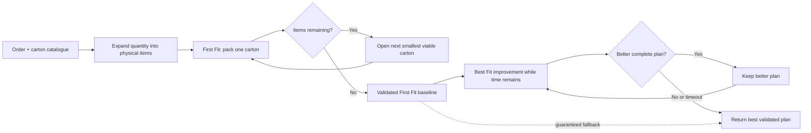

# 3D Bin Packing Product Specification

## 1. Purpose

This document is the single functional source of truth for the reusable 3D bin packing solver.

The product is a Python package named `bin_packing_3d`. Users call one public function:

```python
from bin_packing_3d import solve_order

result = solve_order(
    order=order,
    boxes=boxes,
    config=config,
)
```

A future API may call the same function, but there must not be a second implementation of the packing logic.

## 2. Product Goal

Given an order containing multiple physical items, a configurable carton catalogue, and configurable packing rules, return a valid packing plan that:

1. uses the fewest cartons,
2. among solutions with the same carton count, uses the smallest total external carton volume,
3. then prefers higher utilization,
4. remains deterministic for the same input and configuration.

Validity always comes before optimization.

## 3. Core Solver Mental Model

The packing engine follows the same basic decision loop throughout the project:

**sequence items → choose allowed orientation → choose XYZ position → validate placement → continue or retry**

This is adapted from the study's separation of sequencing, orientating, and loading decisions. The study also loops back to revise sequence when loading fails. Our solver keeps that useful structure but applies it to rectangular cuboids rather than free-form CAD parts.

The initial deterministic sequencing rule is:

1. restricted rotation first,
2. larger volume first,
3. larger longest dimension first,
4. stable item instance identifier.

This also aligns with the study's practical large-first packing logic, where larger parts are placed before smaller parts fill the remaining space.

## 4. Input Contract

### 4.1 Order

Each item requires:

| Field | Meaning |
| --- | --- |
| `Code` | Item identifier |
| `Length`, `Width`, `Height` | Dimensions in mm |
| `Weight` | Unit weight in kg |
| `Quantity` | Number of physical units |
| `VerticalRotation` | Whether the item may be laid onto another axis |
| `UOM` | Optional descriptive unit |

`OrderId` and `OrderNo` should be preserved when supplied.

`Quantity > 1` is expanded into separate physical item instances before packing.

### 4.2 Carton catalogue

Each carton requires:

| Field | Meaning |
| --- | --- |
| `Code` | Carton identifier |
| `Length`, `Width`, `Height` | Carton dimensions in mm |
| `MaxWeight` | Maximum packed weight in kg |

The carton catalogue is always input and must not be hard coded.

### 4.3 Configuration

Initial defaults:

```python
{
    "optimization_mode": "bins_number",
    "improvement_strategy": "best_fit",
    "bin_max_fill_check_min_item_qty": 6,
    "bin_max_fill_pct": 70,
    "bin_buffer": {
        "length": 0,
        "width": 0,
        "height": 6,
    },
    "max_runtime_ms": 900,
    "deterministic": True,
}
```

Required behavior:

1. If physical item count is at or below `bin_max_fill_check_min_item_qty`, the fill cap does not restrict the carton.
2. If physical item count is above the threshold, packed item volume must not exceed `bin_max_fill_pct` of usable carton volume.
3. Buffer reduces usable carton dimensions before placement checks.
4. MVPs 1 to 3 always build the initial plan with deterministic First Fit.
5. MVP 4 may use `improvement_strategy = "best_fit"` while runtime remains.
6. Invalid configuration values must be rejected clearly.

## 5. Allowed Item Orientations

For `VerticalRotation = true`, generate every unique 90 degree orientation from the original dimensions, up to six orientations:

```text
L × W × H
W × L × H
L × H × W
H × L × W
W × H × L
H × W × L
```

For `VerticalRotation = false`, the original height must remain the vertical Z dimension. Only the horizontal swap is allowed:

```text
L × W × H
W × L × H
```

Duplicate orientations are removed and ordering must be stable.

See [`../docs/images/exact_vertical_rotation_orientations.png`](../docs/images/exact_vertical_rotation_orientations.png) for the exact orientation visual used by the implementation.

## 6. Simplified Package Structure

```text
src/
  PRODUCT_SPEC.md
  bin_packing_3d/
    __init__.py
    models.py
    rules.py
    packing.py
    validate.py

tests/
  test_rules.py
  test_packing.py
  test_validate.py
  test_solver.py
  fixtures/
```

### `__init__.py`

Public facade and orchestrator. It coordinates normalization, packing, optional improvement, final validation, result formatting, and runtime measurement.

### `models.py`

Contains shared structures such as `Item`, `Box`, `Orientation`, `Position`, `Placement`, `EmptySpace`, `PackedBox`, `PackingPlan`, and `PackingConfig`.

### `rules.py`

Owns input normalization and non-search business rules:

1. quantity expansion,
2. dimension, weight, and quantity validation,
3. rotation normalization,
4. allowed orientations,
5. usable carton dimensions after buffer,
6. fill rule,
7. quick weight, volume, and individual-fit checks,
8. carton ordering from smaller to larger.

### `packing.py`

Owns the complete packing engine:

1. item sequencing,
2. boundary checks,
3. overlap checks,
4. remaining empty rectangular spaces,
5. candidate XYZ positions,
6. item orientation and placement,
7. one-carton packing attempts,
8. multiple-carton construction,
9. deterministic First Fit baseline packing,
10. Best Fit improvement search,
11. timeout-safe retention of the best validated plan.

Keep these related operations together until the module becomes genuinely difficult to understand.

### `validate.py`

Independently validates completed plans. A result that fails validation cannot be returned as success.

## 7. Core Geometry Rules

The solver handles rectangular cuboids aligned to the carton X, Y, and Z axes.

A candidate placement is valid only when:

1. its orientation is allowed,
2. all coordinates are non-negative,
3. the item stays within usable carton boundaries,
4. it does not overlap another packed item,
5. carton weight remains within `MaxWeight`,
6. the fill rule remains satisfied.

Touching faces, edges, or corners is allowed and is not overlap.

The solver tracks useful remaining empty rectangular spaces after each placement. Candidate positions are generated from useful corners and boundaries rather than scanning every XYZ coordinate.

## 8. Logical MVP Sequence

The MVP sequence follows the business problem. MVPs 1 to 3 build the fast First Fit baseline. MVP 4 spends only the remaining runtime trying to improve that already-valid plan.

### MVP 1: Fit one item

**Question:** Can one physical item fit correctly, and what is the smallest valid carton?

Scope:

1. validate one physical item and the carton catalogue,
2. generate allowed orientations,
3. enforce `VerticalRotation`, buffer, dimensions and weight,
4. reject cartons that cannot fit the item,
5. choose the smallest valid carton,
6. place the item at a valid origin position,
7. validate the result.

Acceptance gate: orientation and carton selection are correct for representative edge cases.

### MVP 2: Pack one carton

**Question:** Given an order and one carton, how many physical items can First Fit pack validly into it?

Before packing, expand `Quantity` into separate physical item instances so every unit receives its own orientation and XYZ placement.

Then:

1. sequence physical items deterministically,
2. choose an allowed orientation,
3. try candidate XYZ positions,
4. reject overlap and boundary violations,
5. update remaining empty space after each placement,
6. retry another orientation or position when needed,
7. continue until every item is packed or no more items can be placed.

Output:

1. the packed carton and its item placements,
2. the physical items still remaining.

Acceptance gate: the one-carton engine returns a valid layout plus an explicit remaining-item set.

### MVP 3: Pack the whole order

**Question:** Can the full order be packed into the fewest cartons using the First Fit engine?

MVP 3 repeatedly reuses MVP 2:

1. start with all physical items,
2. choose the smallest viable carton,
3. run the one-carton First Fit engine,
4. remove packed items from the remaining set,
5. open another carton only when items remain,
6. repeat until all items are packed or an item is unpackable,
7. independently validate the complete plan.

The result of MVP 3 is the **First Fit baseline plan**.

Complete-plan objective order:

1. valid plan,
2. fewer cartons,
3. lower total external carton volume when carton count is equal,
4. higher utilization,
5. stable deterministic tie break.

Acceptance gate: a representative order produces a complete validated single-carton or multi-carton First Fit plan.

### MVP 4: Improve the baseline plan

**Question:** Is extra search time worth it because it produces a materially better packing plan?

Start with the validated First Fit baseline already produced by MVP 3. Never discard it while improvement is running.

Within the remaining `max_runtime_ms` budget:

1. run Best Fit using the same geometry and packing rules,
2. optionally try a small fixed set of alternative item sequences,
3. compare each complete valid alternative against the best plan already found,
4. keep an alternative only when it uses fewer cartons, or when carton count is equal and total external carton volume is smaller,
5. use higher utilization only as a later tie break,
6. stop immediately when the runtime limit is reached,
7. return the best validated plan found so far.

If Best Fit or another retry does not improve carton count or total carton volume, the First Fit baseline remains the result.

If the improvement search times out before completing, the solver returns the best already-validated plan. The First Fit baseline is therefore the guaranteed fallback.

Do not add simulated annealing, genetic algorithms, deep backtracking or exhaustive search unless benchmark evidence creates a clear need.

## 9. End-to-End Solver Flow



The critical runtime guarantee is simple: **MVP 3 produces a valid First Fit baseline before MVP 4 begins. Improvement may replace that baseline only with a better validated complete plan.**

## 10. First Fit and Best Fit

### First Fit baseline

First Fit is the packing strategy used through MVPs 1 to 3.

For each physical item, it accepts the first valid candidate placement in deterministic order. This keeps the baseline fast and gives the solver a complete valid plan before additional search begins.

### Best Fit improvement

Best Fit is introduced in MVP 4.

It uses the same:

1. item set,
2. allowed orientations,
3. candidate positions,
4. remaining empty spaces,
5. boundary and overlap checks,
6. weight, fill and buffer rules,
7. final validator.

The difference is that Best Fit evaluates more valid placement choices instead of stopping at the first one.

Best Fit is worth keeping only when the resulting complete plan improves the business objective:

1. fewer cartons, or
2. the same carton count with lower total external carton volume.

Runtime alone never makes a plan better. If extra search produces no packing improvement, return the First Fit baseline.

If the runtime limit is reached during Best Fit, return the best validated plan already found.

## 11. Output Contract

The returned object must be JSON serializable and include at minimum:

| Level | Required fields |
| --- | --- |
| Order | order id, order number when supplied, status, carton count, runtime, strategy |
| Carton | carton code, usable dimensions, packed weight, used-space percentage |
| Placement | physical item instance id, source item code, chosen orientation, x, y, z |
| Failure | unpacked physical items and reason when known |

The output must contain enough information to independently reconstruct and validate the packing arrangement.

## 12. Required Tests

Tests should follow the MVP boundaries.

### MVP 1 tests

1. one item fits the smallest valid carton,
2. item too large for a carton is rejected even when volume is smaller,
3. allowed rotation makes a fit possible,
4. the same fit fails when `VerticalRotation = false`,
5. weight and buffer rules are enforced.

### MVP 2 tests

1. `Quantity` is expanded into physical item instances before packing,
2. two `15 × 10 × 10` items can share a suitable carton without overlap,
3. true overlap is rejected,
4. touching faces are allowed,
5. multiple orientations and positions are tried deterministically,
6. the one-carton result returns both packed and remaining items,
7. impossible one-carton layouts fail cleanly.

### MVP 3 tests

1. smallest valid one-carton solution is preferred,
2. multi-carton fallback works when one carton is impossible,
3. already-open cartons are reused when valid,
4. weight and fill rules can force a split,
5. unpackable items are reported,
6. fewer cartons always beat more cartons,
7. equal carton count prefers lower total carton volume,
8. the complete First Fit baseline passes independent validation.

### MVP 4 tests

1. MVP 3 always produces a validated First Fit baseline before improvement,
2. First Fit and Best Fit use the same geometry and business rules,
3. improvement is accepted when it reduces carton count,
4. equal carton count accepts lower total carton volume,
5. no material packing improvement leaves the First Fit baseline unchanged,
6. alternative sequences remain deterministic,
7. invalid retry candidates are rejected,
8. runtime limit stops further improvement and returns the best validated plan already found.

### Final validation tests

Each final validation rule needs both a passing case and a deliberately corrupted failing case.

## 13. Benchmarking

Historical iHub outputs are a reference benchmark, not mathematical ground truth.

Primary benchmark question:

**Can the solver produce valid plans with competitive carton count at real-time latency?**

Initial targets:

| Metric | Target |
| --- | ---: |
| Successful returned plan validity | 100% |
| Median runtime | below 250 ms |
| P95 runtime | below 1,000 ms |
| Repeatability | same logical result for the same input and strategy |

For MVP 4, report the First Fit baseline and the improved result separately. Record runtime overhead, whether carton count was reduced, whether total carton volume was reduced at equal carton count, and how often extra search produced no material packing improvement.

## 14. Development Rule for Codex

Codex should implement from this specification and should not invent new product behavior.

Preferred implementation sequence:

1. create the five-file package skeleton and tests,
2. implement MVP 1 item fit and orientation rules,
3. implement MVP 2 one-carton First Fit packing with quantity expansion and remaining-item output,
4. implement MVP 3 full-order First Fit orchestration and independent validation,
5. benchmark the First Fit baseline,
6. implement MVP 4 Best Fit improvement with strict timeout fallback to the best validated plan.

Review and commits should remain separated by MVP so regressions are easy to identify.

Simplicity is a product requirement for this project.

