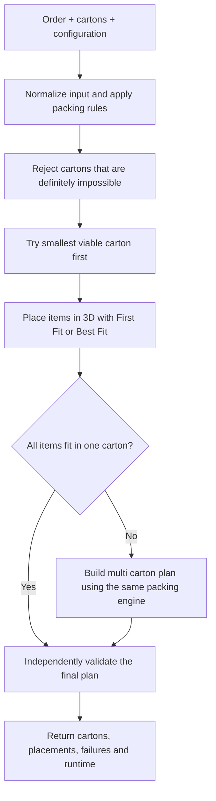

# 3D Bin Packing Product Specification

## 1. Purpose

This document is the single functional source of truth for the reusable 3D bin packing solver.

The goal is to keep the product small enough to understand and test as one system while still separating the few responsibilities that genuinely need their own module.

The reusable Python package is named `bin_packing_3d`. Users call one public function:

```python
from bin_packing_3d import solve_order

result = solve_order(
    order=order,
    boxes=boxes,
    config=config,
)
```

A future API may call the same function, but the Python package is the product. There must not be a second implementation of the packing logic.

## 2. Product Goal

Given an order, a configurable carton catalogue and configurable packing rules, return a valid packing plan while minimizing carton count as the primary objective.

Priority order for complete solutions:

1. Valid solution beats invalid solution.
2. Fewer cartons.
3. Lower total external carton volume.
4. Higher utilization.
5. Stable deterministic tie break.

Validity always comes before optimization.

## 3. Must Have Features

The final MVP solver must:

1. Accept the iHub style order structure and a configurable carton catalogue.
2. Expand `Quantity > 1` into physical item instances for packing.
3. Respect item dimensions and `VerticalRotation`.
4. Enforce carton maximum weight.
5. Apply configurable carton buffer to usable dimensions.
6. Apply the configurable fill rule based on physical item count.
7. Pack multiple items into the same carton using actual 3D coordinates.
8. Detect carton boundary violations and item overlap.
9. Support single carton and multiple carton solutions.
10. Minimize carton count first.
11. Support First Fit and Best Fit using the same packing engine.
12. Return unpacked items when no valid packing is possible.
13. Return explainable placements including carton, item, orientation and XYZ position.
14. Independently validate every successful result before returning it.
15. Measure runtime and behave deterministically for the same input and configuration.

Not required for the core MVP:

1. Exact mathematical optimization.
2. Simulated annealing.
3. Genetic algorithms.
4. Deep backtracking or exhaustive search.
5. Arbitrary angle or diagonal placement.
6. Physical support, stability or center of gravity modelling.
7. Web UI.
8. Production deployment infrastructure.

## 4. Input Contract

### 4.1 Order

Each item requires:

| Field | Meaning |
| --- | --- |
| `Code` | Item identifier |
| `Length`, `Width`, `Height` | Dimensions in mm |
| `Weight` | Unit weight in kg |
| `Quantity` | Number of physical units |
| `VerticalRotation` | Whether the item may be laid onto another axis |
| `UOM` | Optional descriptive unit |

`OrderId` and `OrderNo` should be preserved when supplied.

### 4.2 Carton catalogue

Each carton requires:

| Field | Meaning |
| --- | --- |
| `Code` | Carton identifier |
| `Length`, `Width`, `Height` | External carton dimensions in mm |
| `MaxWeight` | Maximum packed weight in kg |

The catalogue is always input. Carton dimensions must not be hard coded in the engine.

### 4.3 Configuration

Initial defaults:

```python
{
    "optimization_mode": "bins_number",
    "placement_strategy": "first_fit",
    "bin_max_fill_check_min_item_qty": 6,
    "bin_max_fill_pct": 70,
    "bin_buffer": {
        "length": 0,
        "width": 0,
        "height": 6,
    },
    "max_runtime_ms": 900,
    "deterministic": True,
}
```

Required behavior:

1. If physical item count is at or below `bin_max_fill_check_min_item_qty`, the fill cap does not restrict the carton.
2. If physical item count is above the threshold, total packed item volume must not exceed `bin_max_fill_pct` of usable carton volume.
3. Buffer reduces usable carton dimensions before placement checks.
4. Unknown strategies or invalid configuration values must be rejected clearly.

## 5. Allowed Item Orientations

For `VerticalRotation = true`, generate every unique 90 degree orientation from the item's three dimensions, up to six orientations.

For `VerticalRotation = false`, the original height must remain the vertical Z dimension. Length and width may swap horizontally.

Duplicate orientations must be removed and ordering must be stable.

## 6. Simplified Package Structure

```text
src/
  PRODUCT_SPEC.md
  bin_packing_3d/
    __init__.py
    models.py
    rules.py
    packing.py
    validate.py

tests/
  test_rules.py
  test_packing.py
  test_validate.py
  test_solver.py
  fixtures/
```

Only five implementation files are required.

### `__init__.py`

Public facade and orchestrator.

Owns `solve_order()` and coordinates:

1. input normalization,
2. rule validation,
3. First Fit or Best Fit selection,
4. single carton attempt,
5. multiple carton fallback,
6. final validation,
7. result formatting and runtime.

It must not implement geometry itself.

### `models.py`

Contains the small internal data structures used by the solver, for example:

`Item`, `Box`, `Orientation`, `Position`, `Placement`, `EmptySpace`, `PackedBox`, `PackingPlan`, `PackingConfig`.

Models hold data and simple derived properties only.

### `rules.py`

Owns all non search business rules:

1. normalize external input,
2. expand quantities,
3. validate positive dimensions, weight and quantity,
4. normalize rotation flags,
5. calculate usable carton dimensions after buffer,
6. calculate active fill limit,
7. generate allowed orientations,
8. perform quick carton rejection by weight, fill and individual item fit,
9. sort candidate cartons from smaller to larger usable volume.

This keeps iHub specific operational rules separate from the placement algorithm.

### `packing.py`

Owns the complete packing engine.

This one module contains related geometry and search operations rather than splitting them across many files:

1. boundary checks,
2. overlap checks,
3. remaining empty rectangular spaces,
4. candidate position generation,
5. deterministic item ordering,
6. First Fit candidate selection,
7. Best Fit candidate scoring,
8. one carton packing attempt,
9. single carton search,
10. multiple carton construction,
11. optional bounded improvement introduced only in MVP 3.

Private helper functions are encouraged. Separate Python files are not required for every helper concept.

### `validate.py`

Independent validator for completed plans.

It must verify:

1. every physical item is accounted for exactly once,
2. every packed orientation is allowed,
3. every placement is inside usable carton boundaries,
4. no two items overlap,
5. weight limits are respected,
6. fill rules are respected,
7. buffer adjusted dimensions are respected,
8. result status and carton counts are internally consistent.

A plan that fails validation cannot be returned as success.

## 7. Core Packing Logic

The solver uses rectangular 3D items and cartons aligned to X, Y and Z axes.

The V1 search representation is **remaining empty rectangular spaces**: after an item is placed, the solver tracks the useful rectangular regions still available inside that carton.

A **candidate position** is a useful corner or boundary position where the next item may be tested. The solver does not scan every possible coordinate.

The packing engine must be deterministic.

### 7.1 Item ordering

Before a carton packing attempt, physical items are ordered by:

1. restricted rotation first,
2. larger volume first,
3. larger longest dimension first,
4. stable item instance identifier.

Both First Fit and Best Fit use exactly the same item order.

### 7.2 Placement validity

A candidate placement is valid only when:

1. the orientation is allowed,
2. all coordinates are non negative,
3. the item remains within usable carton dimensions,
4. the item does not overlap an already packed item,
5. carton weight remains within `MaxWeight`,
6. the fill rule remains satisfied.

Touching faces, edges or corners is allowed and is not overlap.

### 7.3 Remaining empty spaces

A fresh carton starts with one empty space equal to its usable dimensions.

After each placement:

1. affected empty spaces are split around the placed item,
2. zero volume spaces are removed,
3. duplicate spaces are removed,
4. spaces fully contained in another retained space are removed,
5. spaces that cannot fit any remaining item may be removed,
6. retained spaces are kept in stable lower position first order.

The implementation may use standard maximal space style splitting, but the public contract is the behavior above rather than a specific academic implementation.

## 8. First Fit and Best Fit

First Fit and Best Fit must share:

1. item order,
2. allowed orientations,
3. remaining empty spaces,
4. candidate positions,
5. validity checks,
6. carton rules,
7. final validator.

The only intended difference is how a valid candidate is selected.

### First Fit

For each item, inspect candidate placements in deterministic order and accept the first valid candidate.

It must stop evaluating candidates once a valid placement is accepted.

### Best Fit

For each item, inspect the same valid candidate placements and choose the preferred candidate using this fixed order:

1. lower resulting top height,
2. smaller wasted remainder in the chosen empty space,
3. lower Z coordinate,
4. lower Y coordinate,
5. lower X coordinate,
6. stable orientation tie break.

The scoring rule may be revised only through an explicit product spec change after benchmark evidence.

## 9. Single Carton and Multiple Carton Logic

### 9.1 Quick rejection

Before expensive 3D placement, reject a candidate carton when any of these are definitely impossible:

1. total order weight exceeds the carton limit for a one carton attempt,
2. total order volume exceeds the active allowed fill volume,
3. any physical item cannot fit individually in any allowed orientation.

Passing these checks does not prove that the order fits. It only means the carton is worth attempting geometrically.

### 9.2 Single carton first

Try viable cartons in ascending usable volume.

For each carton, run the full 3D packing attempt using the configured strategy.

Stop at the first valid one carton solution because the primary objective is carton count and the cartons are already ordered from smaller to larger.

### 9.3 Multiple carton fallback

Only when no one carton solution works:

1. process physical items in the same deterministic difficult first order,
2. try to add an item to an already open carton,
3. confirm the affected carton can still be packed geometrically,
4. if no open carton can accept it, open the smallest viable carton that can accept it,
5. continue until all items are packed or an item cannot fit any carton.

When more than one existing carton can accept an item, prefer the carton that avoids opening a new carton and then the smaller resulting unused volume.

Every carton in a multiple carton solution must independently satisfy weight, fill, buffer, rotation and geometry rules.

## 10. End to End Flow



This is intentionally the whole system view. Helper functions should not become separate architecture boxes unless they become independently meaningful components.

## 11. MVP Sequence

### MVP 1: Complete First Fit Solver

Purpose: deliver the smallest solver that is already useful end to end.

Must include:

1. public `solve_order()` interface,
2. input validation and normalization,
3. quantity expansion,
4. rotation handling,
5. buffer, fill and weight rules,
6. quick carton rejection,
7. 3D boundary and overlap checks,
8. remaining empty space tracking,
9. deterministic First Fit placement,
10. smallest viable single carton search,
11. multiple carton fallback,
12. unpackable item reporting,
13. independent final validation,
14. JSON serializable output,
15. runtime measurement,
16. deterministic tests.

Acceptance gate: the solver can process representative orders from input to validated result without Best Fit or any improvement layer.

### MVP 2: Best Fit Comparison

Purpose: answer whether extra placement evaluation is worth the runtime cost.

Add only:

1. `placement_strategy = "best_fit"`,
2. Best Fit candidate scoring,
3. strategy parity tests proving both strategies use the same candidate generator and constraints,
4. benchmark report comparing First Fit and Best Fit.

Required benchmark metrics:

1. median runtime,
2. P95 runtime,
3. maximum runtime,
4. valid full order packing rate,
5. carton count,
6. exact reference carton count match rate,
7. total carton volume,
8. utilization,
9. orders where First Fit and Best Fit differ.

No post packing improvement is allowed during this comparison because it would hide the difference between the two strategies.

### MVP 3: Bounded Improvement

Purpose: improve difficult cases only if MVP 2 shows there is useful headroom.

Permitted additions:

1. a small fixed set of alternative item orderings,
2. attempt to eliminate the least used carton by repacking its items into the remaining cartons,
3. retain only candidates that improve the shared complete plan objective,
4. stop when `max_runtime_ms` is reached,
5. always retain the best already validated plan.

Do not add simulated annealing, genetic algorithms or deep backtracking unless a later benchmark creates a clear requirement.

MVP 3 is optional. If MVP 1 or MVP 2 already meets the project performance and packing quality goals, the project may stop there.

## 12. Output Contract

The returned object must be JSON serializable and include at minimum:

| Level | Required fields |
| --- | --- |
| Order | order id, order number when supplied, status, carton count, runtime, strategy |
| Carton | carton code, usable dimensions, packed weight, used space percentage |
| Placement | physical item instance id, source item code, orientation, x, y, z |
| Failure | unpacked physical items and reason when known |

The output should expose enough information to independently reconstruct and validate the packing arrangement.

## 13. Required Tests

Tests should target behavior rather than mirror every private helper function.

### `test_rules.py`

Must cover:

1. quantity expansion,
2. invalid dimensions, weight and quantity,
3. rotation normalization,
4. allowed orientations,
5. upright only behavior,
6. buffer calculation,
7. fill threshold behavior,
8. weight rejection,
9. individual item fit rejection,
10. stable carton ordering.

### `test_packing.py`

Must cover:

1. one item fits at origin,
2. two `15 x 10 x 10` items fit inside one `20 x 20 x 20` carton,
3. one `30 x 10 x 20` item fails inside a `20 x 20 x 20` carton,
4. required rotation succeeds when allowed,
5. the same case fails when rotation is restricted,
6. touching items do not count as overlap,
7. true overlap is rejected,
8. smallest valid one carton is chosen,
9. geometry can force fallback to a larger carton,
10. multi carton packing succeeds when one carton is impossible,
11. weight can force a carton split,
12. fill rule can force a carton split,
13. unpackable items are returned,
14. First Fit stops at the first valid candidate,
15. Best Fit evaluates the shared valid candidate set,
16. repeated runs are deterministic.

### `test_validate.py`

Each final validation rule needs both a passing case and a deliberately corrupted failing case.

### `test_solver.py`

Must cover:

1. full First Fit end to end success,
2. full Best Fit end to end success after MVP 2,
3. single carton short circuit,
4. multi carton fallback,
5. invalid input failure,
6. unpackable result,
7. validation before success,
8. runtime and strategy reported,
9. JSON serializable result,
10. same input and strategy return the same logical result.

## 14. Benchmarking

Historical iHub outputs are a reference benchmark, not mathematical ground truth.

A solver result is acceptable when it is valid and follows the shared objective even when its exact placements or carton choice differ from the historical result.

Primary benchmark question:

**Can the solver produce valid plans with competitive carton count at real time latency?**

Initial engineering target:

| Metric | Target |
| --- | ---: |
| Successful returned plan validity | 100% |
| Median runtime | below 250 ms |
| P95 runtime | below 1,000 ms |
| Repeatability | same logical result for same input and strategy |

First Fit and Best Fit must always be reported separately.

## 15. Development Rule for Codex

Codex should implement from this specification, not invent new product behavior.

Preferred implementation sequence:

1. create the five file package skeleton and tests,
2. implement MVP 1 completely,
3. run tests and benchmark representative fixtures,
4. implement MVP 2 without changing shared geometry behavior,
5. run the First Fit versus Best Fit benchmark,
6. implement MVP 3 only when benchmark results justify it.

A one shot implementation is acceptable if all tests and contracts are implemented together, but review and commits should still be separated by MVP so regressions are easy to identify.

Do not split private helper functions into new modules unless the existing file has become genuinely difficult to understand. Simplicity is a product requirement for this project.
