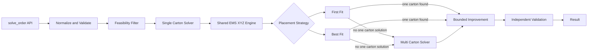

# Solver Product Specification

## 1. Purpose

This document is the functional source of truth for the iHub cartonization solver before implementation begins.

The objective is to agree exactly how each component behaves, what it receives, what it returns, what it must reject, and how it will be tested. Technical implementation must follow these contracts rather than allowing code choices to define product behavior after the fact.

The product is a reusable Python packing engine. Users interact with one public function only. Internal modules remain independently testable so the solver can be developed component by component and later exposed through an API without rewriting the packing logic.

## 2. Product Goal

Given an order, a configurable carton catalogue, and configurable packing rules, return a valid packing plan within a bounded runtime while minimizing carton count as the primary objective.

A one carton solution always beats a two carton solution when both are valid. Among solutions using the same number of cartons, prefer lower total carton volume and then higher utilization.

Validity always comes before optimization. An invalid arrangement must never be returned merely because it uses fewer cartons.

## 3. Selected V1 Solver Strategy

The V1 geometric foundation is a deterministic **EMS based 3D cuboid packing engine**.

EMS means **Empty Maximal Space**. The solver represents usable remaining regions of a carton as axis aligned rectangular empty spaces. Items are tested only at meaningful candidate positions inside those spaces. Arbitrary XYZ grid scanning and exhaustive search are out of scope.

The EMS geometry is shared by two placement strategies:

1. **First Fit** is the baseline strategy.
2. **Best Fit** is the comparison strategy.

Both strategies must use the same item ordering, legal orientations, EMS representation, candidate positions, collision checks, carton rules, and final validator. This isolates the tradeoff between placement selection strategies rather than comparing two completely different engines.

### 3.1 First Fit baseline

First Fit iterates candidates in deterministic order and accepts the first valid placement.

Conceptually:

```python
for space in ordered_spaces:
    for orientation in legal_orientations:
        for position in candidate_positions:
            if placement_is_valid(...):
                return placement
```

First Fit does not score every valid candidate before placing the item.

Its purpose is to establish the simplest fast baseline and answer how far a low search cost strategy can go before additional placement evaluation becomes worthwhile.

### 3.2 Best Fit comparison

Best Fit uses the exact same candidate generation but evaluates all valid candidates within the configured bounds, scores them deterministically, and selects the preferred placement.

Conceptually:

```python
valid_candidates = []

for space in ordered_spaces:
    for orientation in legal_orientations:
        for position in candidate_positions:
            if placement_is_valid(...):
                valid_candidates.append(score(...))

return best(valid_candidates)
```

Best Fit exists to test whether extra candidate evaluation produces better packing outcomes that justify the additional latency.

### 3.3 Experimental question

The project must not assume Best Fit is better overall simply because it searches more placements.

The benchmark must answer:

1. Is First Fit materially faster at median and P95 latency?
2. How often does Best Fit reduce carton count relative to First Fit?
3. When carton count is equal, does Best Fit select lower total carton volume?
4. Does Best Fit improve volumetric utilization?
5. On which order complexity bands do the strategies diverge?
6. Is any improvement large enough to justify the added search cost?

The default production strategy should be selected only after these results are measured.

### 3.4 Algorithm boundary

Included in V1:

1. Empty Maximal Spaces as the remaining space representation.
2. Legal axis aligned item orientations.
3. Extreme or corner candidate positions inside each EMS.
4. Exact cuboid boundary and collision checks.
5. Deterministic First Fit placement.
6. Deterministic Best Fit placement for comparison.
7. EMS update and pruning after every placement.
8. Deterministic item ordering.
9. Independent final validation.
10. Strategy level benchmarking.

Deferred until benchmark evidence shows they are needed:

1. Randomized multi start search.
2. Simulated annealing or genetic algorithms.
3. Large neighborhood search.
4. Layer based DFS or backtracking.
5. Physical support ratio or center of gravity constraints.
6. Parallel search workers.
7. Voxel or FFT based arbitrary shape packing.

The design is inspired by established cuboid packing techniques and the implementation pattern reviewed in `Xebet/3d-packing-simulator`, while remaining an independently implemented Python solver adapted to iHub specific rules.

## 4. Performance Goal

The engineering target is a P95 runtime below 1,000 ms per representative order.

The solver is heuristic. It does not need to prove the global mathematical optimum for every possible 3D packing problem. It should find a valid plan quickly, then use any remaining runtime budget for bounded improvement only when configured.

| Metric | Initial target |
| --- | ---: |
| Median runtime | below 250 ms |
| P95 runtime | below 1,000 ms |
| Validity | 100% of returned packed solutions pass independent validation |
| Determinism | Same inputs, configuration, and strategy return the same result |
| Optimization priority | Minimize carton count first |

First Fit and Best Fit latency must be reported independently.

## 5. Public Interface

```python
from ihub_packing import solve_order

result = solve_order(
    order=order,
    boxes=boxes,
    config=config,
)
```

`solve_order()` is the only function normal users need to call.

The package `__init__.py` is the public facade and orchestrator. Internal modules are implementation details and are directly imported only by tests and developers.

A later FastAPI endpoint should call the same function rather than create another solver implementation.

The strategy should be configurable without changing solver code:

```python
config = {
    "placement_strategy": "first_fit"
}
```

Supported V1 values are `first_fit` and `best_fit`.

## 6. Conceptual Package Structure

```text
src/
  PRODUCT_SPEC.md
  ihub_packing/
    __init__.py
    models.py
    normalize.py
    orientation.py
    feasibility.py
    geometry.py
    spaces.py
    placement.py
    strategies.py
    single_box.py
    multi_box.py
    improve.py
    validate.py
    result.py

tests/
  test_normalize.py
  test_orientation.py
  test_feasibility.py
  test_geometry.py
  test_spaces.py
  test_placement.py
  test_strategies.py
  test_single_box.py
  test_multi_box.py
  test_improve.py
  test_validate.py
  test_solve_order.py
  fixtures/
```

`spaces.py` owns EMS creation, splitting, candidate position generation, and pruning.

`placement.py` owns shared placement candidate generation and validation.

`strategies.py` owns the difference between First Fit and Best Fit so geometry is not duplicated.

## 7. End to End Functional Flow



The strategy changes how a valid placement is selected. It does not change the business rules or the geometry engine.

## 8. Core Data Contracts

### 8.1 Physical Item

`Quantity` is expanded during normalization so every unit becomes one physical item instance.

| Field | Meaning |
| --- | --- |
| `item_id` | Unique internal physical item identifier |
| `code` | Source item code |
| `length` | Original item length in mm |
| `width` | Original item width in mm |
| `height` | Original item height in mm |
| `weight` | Unit weight in kg |
| `vertical_rotation` | Whether the item may be laid onto another axis |
| `uom` | Descriptive source unit |
| `source_line_index` | Source item line position |

### 8.2 Carton

| Field | Meaning |
| --- | --- |
| `code` | Carton identifier |
| `length` | Length before configured buffer |
| `width` | Width before configured buffer |
| `height` | Height before configured buffer |
| `max_weight` | Maximum packed weight |

Effective internal dimensions are calculated after applying the configured buffer.

### 8.3 Empty Maximal Space

An EMS is an axis aligned rectangular region currently available for placement.

| Field | Meaning |
| --- | --- |
| `x`, `y`, `z` | Origin of the empty space |
| `length`, `width`, `height` | Dimensions of the empty space |

The initial EMS for an empty carton is the complete effective internal carton volume starting at `(0, 0, 0)`.

### 8.4 Configuration

| Setting | Initial default | Functional meaning |
| --- | ---: | --- |
| `optimization_mode` | `bins_number` | Minimize number of cartons |
| `placement_strategy` | `first_fit` | Baseline placement selection strategy |
| `bin_max_fill_check_min_item_qty` | 6 | Fill cap activates above this physical item count |
| `bin_max_fill_pct` | 70 | Maximum volumetric fill after the threshold |
| `bin_buffer.length` | 0 mm | Reserved length clearance |
| `bin_buffer.width` | 0 mm | Reserved width clearance |
| `bin_buffer.height` | 6 mm | Reserved height clearance |
| `max_runtime_ms` | 900 ms | Solver search and improvement budget |
| `max_ems_spaces` | 200 | Initial safety cap on retained EMS regions |
| `max_candidate_positions_per_ems` | 8 | Initial bounded candidate count per EMS |
| `deterministic` | true | No random search in V1 |

The safety caps are tunable and must be benchmarked before being treated as stable defaults.

## 9. Component Specifications

### 9.1 `__init__.py`: Public Orchestrator

Responsibility: expose `solve_order()` and coordinate the complete solver flow without implementing geometry.

Functional behavior:

1. Start runtime measurement and establish the deadline.
2. Normalize external input.
3. Validate input structures.
4. Run cheap carton feasibility filtering.
5. Resolve the configured placement strategy.
6. Attempt the single carton solver first.
7. Call the multi carton solver only when no valid one carton solution exists.
8. Run bounded improvement only when configured and runtime remains.
9. Independently validate the final plan.
10. Format and return the result.
11. Never return an invalid plan as success.

Tests must verify call ordering, strategy propagation, single carton short circuiting, multi carton fallback, deadline propagation, validation before success, deterministic output, and failure propagation.

### 9.2 `models.py`: Internal Data Models

Responsibility: define shared data structures such as `Item`, `Box`, `Orientation`, `Position`, `Placement`, `EmptySpace`, `PackedBox`, `PackingPlan`, `PackingConfig`, and `PackingResult`.

Models contain data and small derived properties only. Solver decisions do not belong in model classes.

Tests cover volume calculations, effective carton dimensions, serialization, equality required for deterministic comparison, and invalid values.

### 9.3 `normalize.py`: Input Normalization

Functional behavior:

1. Validate dimensions and weight are positive numeric values.
2. Validate quantity is a positive integer.
3. Expand `Quantity > 1` into physical item instances.
4. Preserve source traceability.
5. Normalize `VerticalRotation` to boolean.
6. Apply defaults only when settings are missing.
7. Reject cartons whose effective dimensions become zero or negative after buffer.
8. Reject duplicate carton codes.
9. Reject unknown placement strategies.

Tests cover valid input, quantity expansion, malformed dimensions, invalid quantity, missing fields, boolean normalization, duplicate carton codes, strategy normalization, defaults, and invalid buffer effects.

### 9.4 `orientation.py`: Legal Orientations

For `VerticalRotation = true`, generate every unique axis aligned permutation of length, width, and height, up to six orientations.

For `VerticalRotation = false`, the original height remains the vertical Z dimension. Length and width may swap horizontally, producing one or two unique orientations.

Duplicate orientations must be removed and results must have deterministic order. Orientation results may be cached by item dimensions and rotation rule because equivalent items reuse the same orientation set.

Tests cover six orientation cuboids, repeated dimensions, cubes, upright only items, horizontal swaps, duplicate removal, caching equivalence, and deterministic ordering.

### 9.5 `feasibility.py`: Cheap Feasibility Filter

For each candidate carton:

1. Calculate effective dimensions after buffer.
2. Check total order weight for a one carton attempt.
3. Calculate the active fill limit from physical item count.
4. Reject when total item volume exceeds allowed usable volume.
5. Confirm every physical item can individually fit in at least one legal orientation.
6. Retain only cartons passing all cheap checks.
7. Sort surviving candidates by effective carton volume ascending with stable carton code tie break.

Passing feasibility does not prove the items fit together. It only proves the carton is worth attempting in the XYZ engine.

Tests cover weight, fill, buffer, item dimensional fit, rotation restrictions, candidate ordering, and the six item threshold rule.

### 9.6 `geometry.py`: Geometry Primitives

Required concepts:

```python
fits_inside_box(...)
boxes_overlap(...)
placement_collides(...)
```

`fits_inside_box()` proves a placement remains within effective carton boundaries.

`boxes_overlap()` treats items as axis aligned cuboids. Two cuboids collide only when their occupied intervals overlap on X, Y, and Z simultaneously. Touching faces, edges, or corners are valid and are not overlap.

No soft deformation, diagonal placement, or free angle rotation is supported in V1.

Tests cover containment, boundary touching, separation on each axis, true overlap, face and edge contact, negative coordinates, and buffer adjusted boundaries.

### 9.7 `spaces.py`: EMS Management

Responsibility: maintain the remaining usable rectangular spaces after each placement.

Functional behavior:

1. Start with one EMS equal to the entire effective carton.
2. When an item is placed, identify EMS regions intersected by that placement.
3. Replace affected spaces with the remaining axis aligned sub spaces created around the placement.
4. Discard zero or negative volume spaces.
5. Remove duplicate spaces.
6. Remove spaces fully contained inside another retained space.
7. Remove spaces that cannot fit any remaining item in any legal orientation.
8. Sort spaces deterministically, preferring lower positions and then stable coordinate order.
9. Apply `max_ems_spaces` only after correctness preserving pruning.
10. Generate candidate positions from EMS corners plus useful extreme points formed by boundaries of already placed items.
11. Deduplicate candidate positions and discard positions that cannot hold the tested orientation inside the EMS.

Tests must cover initial space creation, splitting after a placement, duplicate removal, containment pruning, fit based pruning, deterministic order, candidate corner generation, extreme point generation, and safety cap behavior.

### 9.8 `placement.py`: Shared EMS XYZ Engine

Responsibility: generate valid placement candidates using shared geometry and EMS behavior.

Functional behavior:

1. Create the initial EMS through `spaces.py`.
2. Sort items difficult first. V1 priority is restricted rotation, then larger volume, then larger longest dimension, then stable item ID.
3. For the current item, iterate retained EMS regions in deterministic order.
4. For each EMS, iterate legal unique orientations in deterministic order.
5. Generate bounded candidate positions in deterministic order.
6. Reject candidates outside the effective carton.
7. Reject candidates colliding with placed items.
8. Pass valid candidate placements to the configured strategy.
9. Place the strategy selected candidate.
10. Update and prune EMS regions.
11. Continue until every item is placed or no valid candidate exists.
12. Return failure for the current packing attempt when an item cannot be placed.

The shared engine must not contain strategy specific shortcuts that make First Fit and Best Fit evaluate different candidate universes.

#### Required placement fixtures

1. One item fits at origin.
2. Two `15 x 10 x 10` items fit in a `20 x 20 x 20` carton without overlap.
3. One `30 x 10 x 20` item fails in a `20 x 20 x 20` carton regardless of spare volume.
4. A case requiring rotation succeeds when rotation is allowed.
5. The same case fails when upright only rules prohibit the required rotation.
6. Repeated execution with the same strategy returns identical placements.

### 9.9 `strategies.py`: First Fit and Best Fit

Responsibility: select one placement from the valid candidates exposed by `placement.py`.

#### First Fit

1. Consume candidates in the shared deterministic order.
2. Return immediately on the first valid candidate.
3. Do not continue searching after a valid candidate is accepted.
4. Do not calculate Best Fit scoring fields unless they are required for diagnostics.

Tests must prove that First Fit stops after the first valid candidate, preserves deterministic ordering, and does not evaluate later candidates unnecessarily.

#### Best Fit

1. Consume all valid candidates within configured bounds.
2. Score each candidate deterministically.
3. Choose the lexicographically preferred candidate.

Initial Best Fit preference order:

1. lower resulting top height,
2. greater contact with carton boundaries or already placed cuboids,
3. smaller wasted remainder in the chosen EMS,
4. lower vertical coordinate,
5. lower depth coordinate,
6. lower horizontal coordinate,
7. stable orientation and position tie break.

Tests must prove that Best Fit evaluates the same candidate set First Fit could encounter, selects the expected candidate in constructed cases, and remains deterministic.

#### Strategy equivalence contract

For a given packing state, item, configuration, and EMS set:

1. Both strategies use the same ordered candidate generator.
2. Both use the same validity checks.
3. Both use the same business constraints.
4. The only intended difference is when candidate evaluation stops and how a valid candidate is selected.

This contract is essential for a fair benchmark.

### 9.10 `single_box.py`: Single Carton Solver

1. Receive only cartons that passed feasibility checks.
2. Try cartons from smallest effective volume to largest.
3. Call the shared EMS placement engine using the configured strategy.
4. Stop at the first valid carton because any one carton solution satisfies the primary carton count objective.
5. Return failure only after all viable one carton candidates fail.

First Fit and Best Fit must be runnable independently against the same order and carton catalogue.

Tests prove smallest valid carton selection, geometric fallback to the next carton, strategy propagation, and multi carton avoidance when a one carton result exists.

### 9.11 `multi_box.py`: Multi Carton Construction

1. Process difficult items first.
2. Try to insert remaining items into existing open cartons before opening another carton.
3. Repack an affected carton through the shared EMS engine with the configured strategy after proposed insertion rather than trusting volume alone.
4. When no open carton accepts an item, open the smallest feasible carton that can accept it.
5. Continue until all items are packed or an item cannot fit any candidate carton.
6. Return unpacked items explicitly.
7. Enforce weight, fill, buffer, rotation, and geometry constraints for every carton.

Tests cover two carton success, reuse of an open carton, weight split, fill split, geometry split, unpackable items, strategy propagation, and deterministic carton assignment.

### 9.12 `improve.py`: Bounded Improvement

Improvement starts only after a valid plan exists and must remain optional during the First Fit versus Best Fit baseline comparison.

For the initial strategy benchmark, improvement should be disabled so placement strategy effects are not confounded by later optimization.

After the baseline comparison is complete, allowed bounded improvements may include:

1. A small fixed set of deterministic item orderings.
2. For multi carton plans, attempting to remove the least utilized carton by repacking its items into the remaining cartons.
3. Accepting a candidate only when it improves the shared objective ordering.
4. Stopping immediately at the deadline.
5. Always retaining the best already validated plan.

Tests verify that improvement never worsens the objective, deadline checks stop attempts, invalid candidates are rejected, carton elimination works on a constructed fixture, and tie resolution is deterministic.

### 9.13 `validate.py`: Independent Final Validator

For every final plan:

1. Every physical item appears exactly once across packed and unpacked outputs.
2. No unknown item appears.
3. Every packed orientation is permitted.
4. Every placement remains inside effective carton boundaries.
5. No two placements overlap.
6. Packed weight is at or below maximum weight.
7. Volumetric fill respects the configured threshold rule.
8. Buffer adjusted dimensions are respected.
9. Carton count and result status are internally consistent.

The validator must not trust assumptions made by the placement or strategy modules. A plan failing validation cannot be returned with success status.

Each rule requires one passing test and one deliberately corrupted failing test.

### 9.14 `result.py`: Output Formatting

Required public result information:

| Level | Required fields |
| --- | --- |
| Order | order identifier, status, carton count, runtime, objective, placement strategy |
| Carton | code, effective dimensions, packed weight, used space percentage |
| Placement | item identifier, source code, chosen orientation, x, y, z |
| Failure | unpacked physical items and reason where known |

Output must be JSON serializable without FastAPI or another framework.

Tests verify serialization, coordinate preservation, quantity traceability, strategy reporting, stable field names, no internal object leakage, and correct runtime/status output.

## 10. Objective Ordering

All modules comparing complete plans use the same ordering.

| Priority | Comparison |
| ---: | --- |
| 1 | Valid plan beats invalid plan |
| 2 | Fewer cartons |
| 3 | Lower total external carton volume |
| 4 | Higher aggregate volumetric utilization |
| 5 | Stable deterministic tie break by carton codes and placements |

## 11. Unit Testing Strategy

Unit tests are part of the product contract rather than final cleanup.

| Layer | Purpose | Normal CI |
| --- | --- | --- |
| Pure unit tests | One function or module contract | Yes |
| Component tests | Multiple internal functions within one component | Yes |
| End to end tests | `solve_order()` through full internal flow | Yes |
| Strategy parity tests | Prove both strategies share the same candidate universe and constraints | Yes |
| Regression fixtures | Known edge cases that previously failed | Yes |
| Benchmark comparison | Historical iHub records and latency metrics | Separate benchmark job |

Required cross cutting tests:

1. Same input and strategy produce the same output.
2. No returned successful placement contains overlap.
3. No placement exceeds carton boundaries.
4. Upright only items preserve their vertical axis.
5. Packed weight never exceeds carton maximum.
6. Fill policy uses physical item count after quantity expansion.
7. One carton is always preferred over two valid cartons.
8. Unpackable items are reported rather than dropped.
9. Deadline exhaustion returns the best valid plan already found.
10. Final validation rejects a deliberately corrupted solver result.
11. EMS pruning never leaves duplicate or fully contained spaces in constructed fixtures.
12. Placement search remains bounded by configured EMS and candidate limits.
13. First Fit stops on the first valid candidate.
14. Best Fit evaluates the available valid candidates before selection.
15. Both strategies apply identical geometry and business constraints.

## 12. Development Sequence and Acceptance Gates

| Phase | Components | Acceptance gate |
| --- | --- | --- |
| 1 | models, normalize | Internal data contracts stable and normalization tests pass |
| 2 | orientation, geometry | Rotation, bounds, and overlap fully tested |
| 3 | feasibility | Impossible cartons safely pruned |
| 4 | spaces | EMS creation, update, candidate generation, and pruning tested |
| 5 | placement | Shared EMS candidate engine passes constructed geometry fixtures |
| 6 | strategies | First Fit and Best Fit pass parity and selection tests |
| 7 | single_box | Smallest valid one carton selected reliably under both strategies |
| 8 | multi_box | Multiple carton construction and failure handling work under both strategies |
| 9 | validate, result | Independent validation and stable output work |
| 10 | `solve_order()` | Full orchestrator and end to end tests pass |
| 11 | strategy benchmark | First Fit versus Best Fit latency and packing tradeoff documented |
| 12 | improve | Bounded improvement added only after baseline strategy comparison |
| 13 | final benchmark | Historical comparison and runtime profile documented |

No phase is complete only because code exists. Its functional contract and tests must pass first.

## 13. Benchmarking Against iHub

The historical iHub output is a reference benchmark rather than mathematical ground truth.

For every benchmark order, run First Fit and Best Fit independently with bounded improvement disabled.

Record:

| Metric | Purpose |
| --- | --- |
| Valid solution rate | Correctness baseline |
| Carton count | Primary optimization outcome |
| Average cartons per order | Overall carton consumption |
| Orders where Best Fit uses fewer cartons | Direct strategy benefit |
| Orders where First Fit uses fewer cartons | Detect regressions and unexpected behavior |
| Exact historical carton count match | Reference comparison |
| Total external carton volume | Secondary packing efficiency |
| Volumetric utilization | Space efficiency |
| Median runtime | Typical latency |
| P95 runtime | Service level latency |
| Maximum runtime | Tail behavior |
| Runtime delta | Extra latency paid for Best Fit |
| Item count band | Identify where strategies diverge |
| Failure reason | Diagnose unsolved orders |

### 13.1 Primary comparison

The strategy comparison should answer:

> How much additional latency does Best Fit require, and how often does that additional work reduce carton count or carton volume compared with First Fit?

Do not select the default strategy before this evidence exists.

### 13.2 Complexity bands

At minimum, compare outcomes by physical item count:

1. 1 to 3 items.
2. 4 to 6 items.
3. 7 to 10 items.
4. 11 to 15 items.
5. More than 15 items.

Additional bands may be added based on the observed v2 distribution.

### 13.3 Benchmark led escalation rule

Do not add complex search techniques because they sound sophisticated. Add them only when benchmark evidence identifies a meaningful failure mode.

Escalation order:

1. Compare First Fit and Best Fit cleanly.
2. Tune deterministic item ordering.
3. Tune Best Fit scoring.
4. Tune EMS candidate generation and safe pruning limits.
5. Add a small deterministic multi start family only if needed.
6. Consider seeded randomized trials if deterministic variants are insufficient.
7. Consider layer or DFS backtracking only for a clearly identified difficult subset.
8. Consider parallel search only if search quality is good but latency is the bottleneck.

Every escalation requires its own tests and benchmark comparison.

## 14. MVP Boundaries

Included: axis aligned cuboid items, configurable carton catalogue, quantity expansion, orientation restrictions, carton buffer, weight limits, fill limits, EMS based placement, First Fit baseline, Best Fit comparison, multi carton packing, explicit XYZ coordinates, deterministic heuristics, independent validation, and benchmark measurement.

Not included initially: arbitrary angle rotation, deformable products, center of gravity optimization, support ratio, crush resistance, fragile item stacking rules, load bearing physics, robotic insertion planning, voxelization, FFT packing, randomized metaheuristics, or guaranteed global optimality.

## 15. Definition of Done

The MVP is functionally complete when `solve_order()` can process the agreed iHub shaped inputs, run either First Fit or Best Fit through the same EMS geometry engine, produce deterministic and independently validated single or multi carton results, return XYZ placements and unpacked items where appropriate, pass the full automated test suite, and document the measured First Fit versus Best Fit tradeoff on the representative benchmark dataset.

Implementation decisions that change any functional behavior described here must update this specification first, then update tests, then update code.