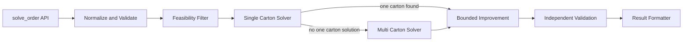

# Solver Product Specification

## 1. Purpose

This document is the functional source of truth for the iHub cartonization solver before implementation begins.

The objective is to agree exactly how each component should behave, what it receives, what it returns, what it must reject, and how it will be tested. Technical implementation should follow these contracts rather than define them after the code already exists.

The product is a reusable Python packing engine. Users should interact with one public function only. Internal modules should remain independently testable so the solver can be developed component by component and later exposed through an API without rewriting the packing logic.

## 2. Product Goal

Given an order, a configurable carton catalogue, and configurable packing rules, return the best valid packing found within a bounded runtime.

The primary optimization objective is carton count. A one carton solution always beats a two carton solution when both are valid. Among solutions using the same number of cartons, the solver should prefer less total carton volume and then higher utilization.

The solver must prioritize validity before optimization. An invalid arrangement must never be returned merely because it uses fewer cartons.

## 3. Performance Goal

The engineering target is a P95 runtime below 1,000 ms per representative order.

The solver is heuristic. It does not need to prove the global mathematical optimum for every possible 3D packing problem. It should find a valid plan quickly, then use any remaining runtime budget for limited improvements.

Recommended initial targets are shown below.

| Metric | Initial target |
| --- | ---: |
| Median runtime | below 250 ms |
| P95 runtime | below 1,000 ms |
| Validity | 100% of returned packed solutions pass independent validation |
| Determinism | Same inputs and configuration return the same result |
| Optimization priority | Minimize carton count first |

The runtime target is measured by the benchmark suite and is not a reason to weaken validity checks.

## 4. Public Interface

The intended package surface is deliberately small.

```python
from ihub_packing import solve_order

result = solve_order(
    order=order,
    boxes=boxes,
    config=config,
)
```

`solve_order()` is the only function normal users need to call.

The package `__init__.py` acts as the public facade and orchestrator. Internal modules remain implementation details and are directly imported only by tests and developers.

A later FastAPI endpoint should call the same function rather than create another solver implementation.

## 5. Conceptual Package Structure

```text
src/
  PRODUCT_SPEC.md
  ihub_packing/
    __init__.py
    models.py
    normalize.py
    orientation.py
    feasibility.py
    geometry.py
    placement.py
    single_box.py
    multi_box.py
    improve.py
    validate.py
    result.py

 tests/
   test_normalize.py
   test_orientation.py
   test_feasibility.py
   test_geometry.py
   test_placement.py
   test_single_box.py
   test_multi_box.py
   test_improve.py
   test_validate.py
   test_solve_order.py
   fixtures/
```

This is the planned module boundary. Implementation may combine files later only when two components genuinely cannot be separated without duplication.

## 6. End to End Functional Flow



The flow intentionally keeps the public API separate from internal solver components. The single carton solver receives the first opportunity because the primary objective is minimizing carton count. Multi carton packing is used only when no valid one carton plan is found.

## 7. Core Data Contracts

### 7.1 Physical Item

`Quantity` is expanded during normalization so every unit becomes one physical item instance.

Each physical item must retain enough information to trace it back to the source line.

| Field | Meaning |
| --- | --- |
| `item_id` | Unique internal physical item identifier |
| `code` | Source item code |
| `length` | Original item length in mm |
| `width` | Original item width in mm |
| `height` | Original item height in mm |
| `weight` | Unit weight in kg |
| `vertical_rotation` | Whether the item may be laid onto another axis |
| `uom` | Descriptive source unit |
| `source_line_index` | Source item line position |

### 7.2 Carton

| Field | Meaning |
| --- | --- |
| `code` | Carton identifier |
| `length` | External usable length before configured buffer |
| `width` | External usable width before configured buffer |
| `height` | External usable height before configured buffer |
| `max_weight` | Maximum packed weight |

The effective internal dimensions are calculated after applying the configured buffer.

### 7.3 Configuration

The first implementation should support the following functional settings.

| Setting | Initial default | Functional meaning |
| --- | ---: | --- |
| `optimization_mode` | `bins_number` | Minimize number of cartons |
| `bin_max_fill_check_min_item_qty` | 6 | Fill cap activates above this physical item count |
| `bin_max_fill_pct` | 70 | Maximum volumetric fill after the threshold |
| `bin_buffer.length` | 0 mm | Reserved length clearance |
| `bin_buffer.width` | 0 mm | Reserved width clearance |
| `bin_buffer.height` | 6 mm | Reserved height clearance |
| `max_runtime_ms` | 900 ms | Solver search and improvement budget |
| `deterministic` | true | No random search unless a fixed seed is explicitly introduced later |

## 8. Component Specifications

## 8.1 `__init__.py`: Public Orchestrator

### Responsibility

Expose `solve_order()` and coordinate the complete solver flow without implementing geometry itself.

### Inputs

Order data, box catalogue, and configuration.

### Functional behavior

1. Start runtime measurement and establish the search deadline.
2. Normalize all external input into internal models.
3. Run input validation.
4. Run cheap carton feasibility filtering.
5. Attempt the single carton solver first.
6. Call the multi carton solver only when no valid one carton solution exists.
7. Pass the best valid plan into bounded improvement while runtime remains.
8. Independently validate the final plan.
9. Format and return the result.
10. If validation fails, never return the invalid plan as success.

### Output

One `PackingResult` object or equivalent serializable structure.

### Unit test contract

Tests must verify call ordering, one carton short circuiting, multi carton fallback, deadline propagation, validation before success, deterministic output, and failure propagation.

## 8.2 `models.py`: Internal Data Models

### Responsibility

Define the internal structures shared by modules.

Expected concepts are `Item`, `Box`, `Orientation`, `Position`, `Placement`, `PackedBox`, `PackingPlan`, `PackingConfig`, and `PackingResult`.

### Functional behavior

Models should contain data and small derived properties only. Solver decisions do not belong in model classes.

### Unit test contract

Tests should verify derived volume, effective carton dimensions, serialization, equality where required for deterministic comparison, and rejection of structurally invalid values.

## 8.3 `normalize.py`: Input Normalization and Validation

### Responsibility

Convert external iHub shaped data into stable internal models.

### Functional behavior

1. Validate required dimensions and weight are positive numeric values.
2. Validate quantity is a positive integer.
3. Expand `Quantity > 1` into individual physical item instances.
4. Preserve source code and source line traceability.
5. Normalize `VerticalRotation` to a boolean.
6. Apply default configuration only when a setting is not supplied.
7. Reject cartons whose effective dimensions become zero or negative after buffer application.
8. Reject duplicate carton codes unless the future contract explicitly allows them.

### Output

Normalized order items, normalized cartons, and normalized configuration.

### Unit test contract

Tests must cover valid source input, quantity expansion, malformed dimensions, zero and negative values, invalid quantity, missing fields, boolean normalization, duplicate carton codes, default configuration, and buffer induced invalid cartons.

## 8.4 `orientation.py`: Allowed Item Orientations

### Responsibility

Return the legal axis aligned orientations for one item.

### Functional behavior

For `VerticalRotation = true`, generate every unique axis aligned orientation formed by permuting length, width, and height. A rectangular cuboid can therefore have up to six unique orientations.

For `VerticalRotation = false`, the original height must remain the vertical Z dimension. Length and width may swap on the horizontal plane. This produces one or two unique orientations depending on whether length and width are equal.

Duplicate orientations must be removed.

### Output

A deterministic ordered list of legal `(length, width, height)` orientations.

### Unit test contract

Tests must cover six orientation cuboids, repeated dimensions, cubes, upright only items, horizontal length width swap, and deterministic ordering.

## 8.5 `feasibility.py`: Cheap Feasibility Filter

### Responsibility

Eliminate cartons that are definitely impossible before running 3D placement.

### Functional behavior

For each candidate carton:

1. Calculate effective dimensions after buffer.
2. Check total order weight against carton maximum weight for a one carton attempt.
3. Calculate the active fill limit from physical item count.
4. Reject the carton when total item volume exceeds allowed usable volume.
5. For every physical item, confirm that at least one legal orientation can individually fit within the effective carton dimensions.
6. Retain only cartons that pass all cheap checks.
7. Sort surviving single carton candidates by effective carton volume ascending, with a stable carton code tie break.

Passing this module does not prove that all items fit together. It only proves that the carton is worth attempting in the 3D solver.

### Unit test contract

Tests must cover weight rejection, fill rejection, buffer effects, an item whose volume fits but dimensions do not, upright orientation restrictions, candidate ordering, and the six item versus more than six item fill threshold behavior.

## 8.6 `geometry.py`: Geometry Primitives

### Responsibility

Provide small pure functions used to prove whether one placement is geometrically valid.

### Required functions conceptually

```python
fits_inside_box(...)
boxes_overlap(...)
placement_collides(...)
```

### Functional behavior

`fits_inside_box()` confirms that the placement starts at nonnegative coordinates and its maximum X, Y, and Z coordinates do not exceed the effective carton dimensions.

`boxes_overlap()` treats placed items as axis aligned rectangular cuboids. Two cuboids collide only when their intervals overlap on X, Y, and Z simultaneously.

Touching faces, edges, or corners are valid and are not considered overlap.

The first MVP does not attempt soft item deformation, diagonal placement, or free angle rotation.

### Unit test contract

Tests must cover containment, boundary touching, X separation, Y separation, Z separation, true 3D overlap, exact face contact, exact edge contact, negative coordinates, and buffer adjusted boundaries.

## 8.7 `placement.py`: One Carton XYZ Placement Engine

### Responsibility

Attempt to place a supplied set of physical items into one carton and return explicit XYZ placements.

This is the core geometric heuristic.

### Functional behavior

1. Start with one candidate placement point at `(0, 0, 0)`.
2. Sort items with difficult items first. The first strategy should prioritize restricted rotation, then larger volume, then larger longest dimension, with stable item identifier tie breaking.
3. For the current item, evaluate every legal orientation at every current candidate point.
4. Reject a candidate placement when it exceeds carton boundaries.
5. Reject a candidate placement when it collides with an existing placement.
6. Score valid candidates deterministically.
7. Select the best candidate placement.
8. After placement, generate new candidate points at the positive X face, positive Y face, and positive Z face of the placed item.
9. Remove duplicate candidate points.
10. Remove points that lie outside the carton or inside an already placed item.
11. Continue until every item is placed or an item has no valid position.
12. Return failure immediately when an item cannot be placed under the current strategy.

### Initial placement score

The initial score should prefer lower positions first and tighter placement second.

Conceptually:

```text
lowest Z
then lowest Y
then lowest X
then smallest remaining bounding extent
```

The exact numeric implementation may change during technical development, but this preference order is part of the functional contract unless benchmark evidence justifies a spec change.

### Physical support boundary

The benchmark does not provide XYZ coordinates or explicit structural stability rules. The first MVP therefore guarantees axis aligned containment and non overlap but does not claim load bearing or center of gravity stability. A later stability rule may be added as a separate module rather than hidden inside collision logic.

### Output

Success returns one packed carton with every physical item assigned an `(x, y, z)` coordinate and chosen orientation.

Failure returns no partial success to the caller. Internal diagnostics may identify the first unplaced item.

### Unit test contract

Tests must include one item at origin, two items side by side, vertical stacking, orientation required to fit, upright only rejection, collision avoidance, candidate point generation, duplicate point cleanup, deterministic placement, and a known impossible arrangement.

A required example is a `20 x 20 x 20` carton with two `15 x 10 x 10` items. Both should fit without overlap.

Another required example is a `20 x 20 x 20` carton with one `30 x 10 x 20` item. It must fail regardless of spare volume.

## 8.8 `single_box.py`: Single Carton Solver

### Responsibility

Find a valid one carton solution before any multi carton search begins.

### Functional behavior

1. Receive only cartons that passed cheap feasibility checks.
2. Try cartons from smallest effective volume to largest.
3. Call the XYZ placement engine for each candidate.
4. Stop immediately when the first valid carton is found under the primary item ordering strategy.
5. If configured improvement time remains, alternative deterministic item orderings may be tested for the same carton but must never cause the solver to switch to a larger carton unless the first result is invalid.
6. Return failure only after every viable one carton candidate fails 3D placement.

### Unit test contract

Tests must prove smallest valid carton selection, skipping infeasible cartons, moving to the next carton after geometric failure, and stopping before multi carton logic when a one carton result exists.

## 8.9 `multi_box.py`: Multi Carton Construction

### Responsibility

Create a valid plan when the order cannot be packed into one carton.

### Functional behavior

1. Process difficult items first using the same deterministic ordering family as the placement engine.
2. Try to insert each remaining item into an already open carton before opening another carton.
3. Repack the affected carton through the XYZ placement engine after a proposed insertion rather than assuming volume alone proves fit.
4. When no open carton accepts the item, open the smallest feasible carton that can accept it.
5. Continue until every physical item is packed or no candidate carton can accept an item.
6. Return unpacked items explicitly when packing is impossible.
7. Never exceed carton weight, fill, rotation, buffer, or geometry constraints.

### Initial carton choice rule

When opening a new carton, prefer the smallest carton that can geometrically accept the next difficult item and whose remaining capacity is plausible for the remaining order.

### Unit test contract

Tests must cover two carton success, reuse of an open carton, opening a new carton only when required, weight driven split, fill driven split, geometry driven split, unpackable item reporting, and deterministic carton assignment.

## 8.10 `improve.py`: Bounded Improvement

### Responsibility

Improve a valid plan without risking unbounded runtime.

### Functional behavior

Improvement begins only after a valid plan exists.

Allowed first phase improvements are:

1. Try a small fixed set of deterministic item ordering strategies.
2. For multi carton plans, attempt to eliminate the least utilized carton by moving its items into remaining cartons.
3. Accept an improved plan when it uses fewer cartons.
4. When carton count is equal, prefer lower total carton volume.
5. When those are equal, prefer higher utilization.
6. Stop immediately when the configured deadline is reached.
7. Always retain the best already validated candidate if a later improvement attempt fails.

The initial implementation should not use simulated annealing, genetic algorithms, large neighborhood search, or random search.

### Unit test contract

Tests must verify that improvement never worsens the objective, deadline checks stop extra attempts, invalid candidate plans are discarded, carton elimination works on a constructed case, and ties are resolved deterministically.

## 8.11 `validate.py`: Independent Final Validator

### Responsibility

Independently prove that the final returned plan respects the functional rules.

The validator must not trust assumptions made by the placement or optimization modules.

### Functional behavior

For every packed carton:

1. Every physical item is present exactly once.
2. No unknown physical item appears.
3. Every item orientation is permitted.
4. Every placement remains inside effective carton boundaries.
5. No two placements overlap.
6. Packed weight is at or below maximum weight.
7. Volumetric fill respects the configured threshold rule.
8. Buffer adjusted dimensions are respected.
9. Packed and unpacked items together account for the full normalized order.

A plan failing validation cannot be returned with success status.

### Unit test contract

Each validation rule requires both one passing test and one deliberately corrupted failing test.

## 8.12 `result.py`: Output Formatting

### Responsibility

Convert the internal plan into a stable explainable public response.

### Required result information

| Level | Required fields |
| --- | --- |
| Order | order identifier, status, carton count, runtime, objective |
| Carton | code, effective dimensions, packed weight, used space percentage |
| Placement | item identifier, source code, orientation dimensions, x, y, z |
| Failure | unpacked physical items and reason where known |

The output should be JSON serializable without requiring FastAPI or another framework.

### Unit test contract

Tests must verify complete serialization, coordinate preservation, quantity traceability, no internal object leakage, stable field names, and correct runtime/status output.

## 9. Objective Ordering

All solver modules that compare complete plans must use the same ordering.

A plan is preferred using the following sequence.

| Priority | Comparison |
| ---: | --- |
| 1 | Valid plan beats invalid plan |
| 2 | Fewer cartons |
| 3 | Lower total external carton volume |
| 4 | Higher aggregate volumetric utilization |
| 5 | Stable deterministic tie break by carton codes and placements |

This shared rule prevents separate modules from optimizing different definitions of better.

## 10. Unit Testing Strategy

Unit tests are part of the product contract rather than a final cleanup activity.

Each component should be implemented only together with its own unit tests. The next component should not rely on an earlier component until those tests pass.

### Test layers

| Layer | Purpose | Runs in normal CI |
| --- | --- | --- |
| Pure unit tests | One function or module contract | Yes |
| Component tests | Multiple internal functions within one component | Yes |
| End to end solver tests | `solve_order()` through full internal flow | Yes |
| Regression fixtures | Known edge cases that previously failed | Yes |
| Benchmark comparison | Historical iHub records and latency metrics | Separate benchmark job |

### Required cross cutting tests

The complete solver suite must include tests for the following behaviors.

1. Same input produces the same output.
2. No returned successful placement contains overlap.
3. No returned placement exceeds carton boundaries.
4. Upright only items never change their vertical axis.
5. Packed weight never exceeds carton maximum weight.
6. Fill policy is applied using physical item count after quantity expansion.
7. One carton is always preferred over two valid cartons.
8. Unpackable items are reported instead of silently dropped.
9. Deadline exhaustion returns the best valid plan already found.
10. Final validator can reject a deliberately corrupted solver result.

## 11. Development Sequence and Acceptance Gates

Implementation should proceed module by module. A later component should not compensate for unclear behavior in an earlier one.

| Phase | Components | Acceptance gate |
| --- | --- | --- |
| 1 | models, normalize | Internal data contracts stable and all normalization tests pass |
| 2 | orientation, geometry | Rotation, bounds, and overlap behavior fully tested |
| 3 | feasibility | Impossible cartons are safely pruned without false acceptance claims |
| 4 | placement | One carton XYZ engine passes constructed geometry fixtures |
| 5 | single_box | Smallest valid one carton can be selected reliably |
| 6 | multi_box | Valid multiple carton construction and unpackable handling work |
| 7 | validate, result | Independent validation and stable public output work |
| 8 | improve | Bounded improvement cannot invalidate a known good plan |
| 9 | `solve_order()` | Full orchestrator flow and end to end tests pass |
| 10 | benchmark | Historical comparison and runtime profile documented |

No phase is considered complete only because code exists. Its functional contract and tests must pass first.

## 12. Benchmarking Against iHub

The historical iHub output is a reference benchmark rather than mathematical ground truth.

For each benchmark order, record the following.

| Metric | Meaning |
| --- | --- |
| Valid solution | Whether all required items were packed correctly |
| Carton count | Primary objective comparison |
| Exact carton count match | Whether our count matches the historical result |
| Carton selection match | Secondary comparison only |
| Utilization | Space efficiency |
| Runtime | Median, P95, and maximum |
| Failure reason | Why an order could not be solved when applicable |

A different carton choice is acceptable when our solution is valid and equal or better on the agreed objective.

## 13. MVP Boundaries

The initial product includes axis aligned cuboid items, configurable carton catalogue, quantity expansion, item orientation restrictions, carton buffer, weight limits, fill limits, single and multiple carton packing, explicit XYZ coordinates, deterministic heuristics, independent validation, and benchmark measurement.

The initial product does not include arbitrary angle rotation, deformable products, center of gravity optimization, crush resistance, fragile item stacking rules, load bearing physics, robot motion planning, or guaranteed global optimality.

These should be introduced later only as explicit functional requirements with their own modules and tests.

## 14. Definition of Done

The MVP is functionally complete when `solve_order()` can process the agreed iHub shaped inputs, produce deterministic and independently validated single or multi carton results, return XYZ placements and unpacked items where appropriate, pass the full automated test suite, and demonstrate the target runtime profile on the representative benchmark dataset.

Implementation decisions that change any functional behavior described here should update this specification first, then update tests, then update code.