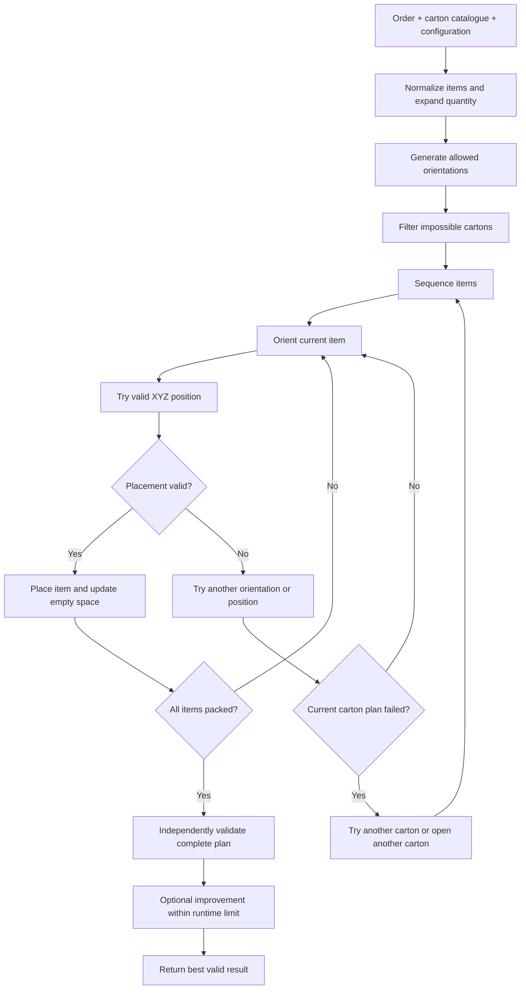

# 3D Bin Packing Product Specification

## 1. Purpose

This document is the single functional source of truth for the reusable 3D bin packing solver.

The product is a Python package named `bin_packing_3d`. Users call one public function:

```python
from bin_packing_3d import solve_order

result = solve_order(
    order=order,
    boxes=boxes,
    config=config,
)
```

A future API may call the same function, but there must not be a second implementation of the packing logic.

## 2. Product Goal

Given an order containing multiple physical items, a configurable carton catalogue, and configurable packing rules, return a valid packing plan that:

1. uses the fewest cartons,
2. among solutions with the same carton count, uses the smallest total external carton volume,
3. then prefers higher utilization,
4. remains deterministic for the same input and configuration.

Validity always comes before optimization.

## 3. Core Solver Mental Model

The packing engine follows the same basic decision loop throughout the project:

**sequence items → choose allowed orientation → choose XYZ position → validate placement → continue or retry**

This is adapted from the study's separation of sequencing, orientating, and loading decisions. The study also loops back to revise sequence when loading fails. Our solver keeps that useful structure but applies it to rectangular cuboids rather than free-form CAD parts.

The initial deterministic sequencing rule is:

1. restricted rotation first,
2. larger volume first,
3. larger longest dimension first,
4. stable item instance identifier.

This also aligns with the study's practical large-first packing logic, where larger parts are placed before smaller parts fill the remaining space.

## 4. Input Contract

### 4.1 Order

Each item requires:

| Field | Meaning |
| --- | --- |
| `Code` | Item identifier |
| `Length`, `Width`, `Height` | Dimensions in mm |
| `Weight` | Unit weight in kg |
| `Quantity` | Number of physical units |
| `VerticalRotation` | Whether the item may be laid onto another axis |
| `UOM` | Optional descriptive unit |

`OrderId` and `OrderNo` should be preserved when supplied.

`Quantity > 1` is expanded into separate physical item instances before packing.

### 4.2 Carton catalogue

Each carton requires:

| Field | Meaning |
| --- | --- |
| `Code` | Carton identifier |
| `Length`, `Width`, `Height` | Carton dimensions in mm |
| `MaxWeight` | Maximum packed weight in kg |

The carton catalogue is always input and must not be hard coded.

### 4.3 Configuration

Initial defaults:

```python
{
    "optimization_mode": "bins_number",
    "placement_strategy": "first_fit",
    "bin_max_fill_check_min_item_qty": 6,
    "bin_max_fill_pct": 70,
    "bin_buffer": {
        "length": 0,
        "width": 0,
        "height": 6,
    },
    "max_runtime_ms": 900,
    "deterministic": True,
}
```

Required behavior:

1. If physical item count is at or below `bin_max_fill_check_min_item_qty`, the fill cap does not restrict the carton.
2. If physical item count is above the threshold, packed item volume must not exceed `bin_max_fill_pct` of usable carton volume.
3. Buffer reduces usable carton dimensions before placement checks.
4. Invalid configuration values must be rejected clearly.

## 5. Allowed Item Orientations

For `VerticalRotation = true`, generate every unique 90 degree orientation from the original dimensions, up to six orientations:

```text
L × W × H
W × L × H
L × H × W
H × L × W
W × H × L
H × W × L
```

For `VerticalRotation = false`, the original height must remain the vertical Z dimension. Only the horizontal swap is allowed:

```text
L × W × H
W × L × H
```

Duplicate orientations are removed and ordering must be stable.

See [`../docs/images/exact_vertical_rotation_orientations.png`](../docs/images/exact_vertical_rotation_orientations.png) for the exact orientation visual used by the implementation.

## 6. Simplified Package Structure

```text
src/
  PRODUCT_SPEC.md
  bin_packing_3d/
    __init__.py
    models.py
    rules.py
    packing.py
    validate.py

tests/
  test_rules.py
  test_packing.py
  test_validate.py
  test_solver.py
  fixtures/
```

### `__init__.py`

Public facade and orchestrator. It coordinates normalization, packing, optional improvement, final validation, result formatting, and runtime measurement.

### `models.py`

Contains shared structures such as `Item`, `Box`, `Orientation`, `Position`, `Placement`, `EmptySpace`, `PackedBox`, `PackingPlan`, and `PackingConfig`.

### `rules.py`

Owns input normalization and non-search business rules:

1. quantity expansion,
2. dimension, weight, and quantity validation,
3. rotation normalization,
4. allowed orientations,
5. usable carton dimensions after buffer,
6. fill rule,
7. quick weight, volume, and individual-fit checks,
8. carton ordering from smaller to larger.

### `packing.py`

Owns the complete packing engine:

1. item sequencing,
2. boundary checks,
3. overlap checks,
4. remaining empty rectangular spaces,
5. candidate XYZ positions,
6. item orientation and placement,
7. one-carton packing attempts,
8. multiple-carton construction,
9. First Fit and Best Fit selection,
10. optional retry and improvement logic.

Keep these related operations together until the module becomes genuinely difficult to understand.

### `validate.py`

Independently validates completed plans. A result that fails validation cannot be returned as success.

## 7. Core Geometry Rules

The solver handles rectangular cuboids aligned to the carton X, Y, and Z axes.

A candidate placement is valid only when:

1. its orientation is allowed,
2. all coordinates are non-negative,
3. the item stays within usable carton boundaries,
4. it does not overlap another packed item,
5. carton weight remains within `MaxWeight`,
6. the fill rule remains satisfied.

Touching faces, edges, or corners is allowed and is not overlap.

The solver tracks useful remaining empty rectangular spaces after each placement. Candidate positions are generated from useful corners and boundaries rather than scanning every XYZ coordinate.

## 8. Logical MVP Sequence

The MVP sequence follows the actual business problem rather than individual algorithm names.

### MVP 0: Fit one item into the correct carton

**Question:** Can one physical item be fitted correctly into the smallest valid carton?

Scope:

1. validate one item and the carton catalogue,
2. generate allowed orientations,
3. enforce `VerticalRotation`, buffer, dimensions, and weight,
4. reject cartons that cannot fit the item,
5. choose the smallest valid carton,
6. place the item at a valid origin position,
7. return and validate the result.

Acceptance gate: orientation and carton selection are correct for representative edge cases.

### MVP 1: Pack multiple items into one carton

**Question:** Can multiple physical items be placed together inside one carton without overlap or boundary violations?

Add:

1. deterministic item sequencing,
2. sequence → orient → place loop,
3. allowed orientation checks for every item,
4. candidate XYZ positions,
5. item-to-item overlap checks,
6. carton boundary checks,
7. remaining empty-space tracking,
8. retry within the current carton when one orientation or position fails,
9. clear success or failure for the one-carton attempt.

Acceptance gate: the solver can return a valid multi-item layout for one carton and correctly reject impossible layouts.

### MVP 2: Solve the full order across the carton catalogue

**Question:** Can the whole order be packed using the fewest cartons, while preferring smaller cartons when carton count is equal?

Add:

1. try viable cartons from smaller to larger,
2. attempt a one-carton solution first,
3. if one carton cannot hold the full order, build a multiple-carton plan,
4. reuse already-open cartons before opening another when valid,
5. open the smallest viable new carton when another carton is required,
6. enforce all weight, fill, buffer, rotation, and geometry rules per carton,
7. return unpackable items explicitly,
8. independently validate the complete plan.

Acceptance gate: the solver can process a representative full order from input to validated single-carton or multi-carton output.

At this point the core business problem is solved.

### MVP 3: Improve the valid plan

**Question:** Can we reduce cartons or carton volume further without losing control of runtime?

Improvement methods may include:

1. compare First Fit against Best Fit using the same geometry engine,
2. try a small fixed set of alternative item sequences,
3. retry difficult carton layouts with a different sequence,
4. attempt to remove a weakly used carton by repacking its items into the others,
5. stop when `max_runtime_ms` is reached,
6. always keep the best already validated plan.

MVP 3 does not mean unlimited optimization. It means controlled retries of an already-working solver.

Do not add simulated annealing, genetic algorithms, deep backtracking, or exhaustive search unless benchmark evidence creates a clear need.

## 9. End-to-End Solver Flow



The important internal loop is:

**sequence → orient → place → validate → retry if needed**

## 10. First Fit and Best Fit

First Fit and Best Fit are improvement strategies, not separate product goals.

Both must use the same:

1. item order for a given trial,
2. allowed orientations,
3. candidate positions,
4. remaining empty spaces,
5. boundary and overlap checks,
6. business rules,
7. final validator.

### First Fit

Accept the first valid candidate in deterministic order.

### Best Fit

Evaluate the available valid candidates and choose the preferred candidate using a deterministic score.

The benchmark should determine whether the extra search improves carton count or carton volume enough to justify the added runtime.

## 11. Output Contract

The returned object must be JSON serializable and include at minimum:

| Level | Required fields |
| --- | --- |
| Order | order id, order number when supplied, status, carton count, runtime, strategy |
| Carton | carton code, usable dimensions, packed weight, used-space percentage |
| Placement | physical item instance id, source item code, chosen orientation, x, y, z |
| Failure | unpacked physical items and reason when known |

The output must contain enough information to independently reconstruct and validate the packing arrangement.

## 12. Required Tests

Tests should follow the MVP boundaries.

### MVP 0 tests

1. one item fits the smallest valid carton,
2. item too large for a carton is rejected even when volume is smaller,
3. allowed rotation makes a fit possible,
4. the same fit fails when `VerticalRotation = false`,
5. weight and buffer rules are enforced.

### MVP 1 tests

1. two `15 × 10 × 10` items can share a suitable carton without overlap,
2. true overlap is rejected,
3. touching faces are allowed,
4. multiple orientations and positions are tried deterministically,
5. impossible one-carton layouts fail cleanly.

### MVP 2 tests

1. smallest valid one-carton solution is preferred,
2. multi-carton fallback works when one carton is impossible,
3. already-open cartons are reused when valid,
4. weight and fill rules can force a split,
5. unpackable items are reported,
6. fewer cartons always beat more cartons,
7. equal carton count prefers lower total carton volume.

### MVP 3 tests

1. First Fit and Best Fit use the same geometry rules,
2. improvement never worsens the objective,
3. alternative sequences remain deterministic,
4. invalid retry candidates are rejected,
5. runtime limit stops further improvement while preserving the best valid plan.

### Final validation tests

Each final validation rule needs both a passing case and a deliberately corrupted failing case.

## 13. Benchmarking

Historical iHub outputs are a reference benchmark, not mathematical ground truth.

Primary benchmark question:

**Can the solver produce valid plans with competitive carton count at real-time latency?**

Initial targets:

| Metric | Target |
| --- | ---: |
| Successful returned plan validity | 100% |
| Median runtime | below 250 ms |
| P95 runtime | below 1,000 ms |
| Repeatability | same logical result for the same input and strategy |

For MVP 3, First Fit and Best Fit must be reported separately for runtime, carton count, total carton volume, and utilization.

## 14. Development Rule for Codex

Codex should implement from this specification and should not invent new product behavior.

Preferred implementation sequence:

1. create the five-file package skeleton and tests,
2. implement MVP 0,
3. implement MVP 1 using the sequence → orient → place loop,
4. implement MVP 2 to solve the full business problem,
5. benchmark the working solver,
6. implement MVP 3 improvement methods only after the full-order solver is valid.

Review and commits should remain separated by MVP so regressions are easy to identify.

Simplicity is a product requirement for this project.
